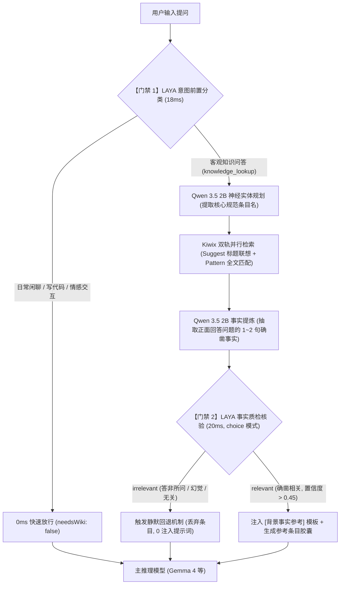

# SimpleUI

<p align="center">
  <a href="README.md"><b>简体中文</b></a> · <a href="README_EN.md">English</a>
</p>

<p align="center">
  <strong>专为 <a href="https://github.com/drumih/turbo-fieldfare">TurboFieldfare</a> 深度定制，全面兼容通用推理引擎的现代化轻量级 AI 客户端</strong>
</p>

<p align="center">
  React 19 · TypeScript · Vite · Tailwind CSS · KaTeX · 原生 macOS 双窗口 · 中英双语
</p>

---

## 目录

- [项目简介](#项目简介)
- [核心特性](#核心特性)
- [快速启动](#快速启动)
- [项目结构](#项目结构)
- [多推理引擎兼容与配置](#多推理引擎兼容与配置)
- [离线维基知识库检索](#离线维基知识库检索)
- [生成配置参数](#生成配置参数)
- [多模态图片支持](#多模态图片支持)
- [Spotlight 模式](#spotlight-模式)
- [macOS 原生桌面应用](#macos-原生桌面应用)
- [开源协议](#开源协议)

---

## 项目简介

SimpleUI 是一款专为 [TurboFieldfare](https://github.com/drumih/turbo-fieldfare)（TTF）量身打造的高性能、极致轻量的前端客户端与 macOS 原生桌面应用。同时，基于对 OpenAI 兼容规范的全面支持，SimpleUI 亦可无缝连接 **Ollama、vLLM、llama.cpp server、LM Studio** 等主流本地与远程推理引擎。

相比 Open WebUI 等重型方案，SimpleUI 剥离了一切多余依赖（无需 Python 虚拟环境、FastAPI、SQLite 或向量数据库），前端静态体积极小，冷启动耗时 **< 300 ms**，内存占用仅约 **30 MB**。

SimpleUI 还内建了由 Swift + WebKit 打造的 **macOS 原生桌面包装层**，支持系统全局热键（`⌥ Option + Space`）秒级唤起如 Spotlight 般的独立胶囊悬浮对话面板。

---

## 核心特性

### ⚡ 极致轻量与专属安全端口
- 基于 **React 19 + TypeScript + Vite + Tailwind CSS**，界面丝滑无卡顿。
- 内置专用 Node.js 高性能代理服务器（`server/proxy.js`），默认监听独立且不易冲突的 **`31235`** 端口，解决常规开发 3000 端口占用难题。
- 原生保真透传 Server-Sent Events (SSE) 流式传输与 `: ping` 心跳包，彻底杜绝跨域（CORS）与请求超时截断。

### 📚 纯粹化离线维基 RAG 与 LAYA 快思考双门禁
- **原生服务集成**：无缝对接本地 Kiwix (ZIM) 离线维基，主界面与设置面板实时呈现联机状态、词条规模（数百万条目）与存储状态。
- **LAYA 前置意图门禁（~18ms）**：在流水线最前置调用本地 LAYA-MLX（Metal GPU 加速）进行 System 1 毫秒级意图判别。对于打招呼、闲聊日常、写代码等需求直接 0ms 快速放行，杜绝无关算力消耗。
- **纯神经实体规划（Qwen 3.5 2B）**：彻底摒弃机械正则与硬编码切片，由 2B 轻量模型智能提炼百科核心规范实体。
- **Kiwix 双轨并行检索**：前缀联想（Suggest）+ 全文检索（Pattern Search）双轨并行，确保描述性查询（如“中国第一颗原子弹”）100% 精准召回专有规范条目（如《596工程》）。
- **LAYA 后置事实质检门禁（~20ms）**：基于多语言 ModernBERT（JHU mmBERT，256,000 词表）对提炼事实展开标准 `choice` 语义二分类校验，彻底消除模型幻觉与答非所问。
- **静默回退（Silent Fallback）与纯净历史**：质检未通过或事实不确凿时，界面 0 显示徽标、向主模型 0 注入提示词；多轮会话严格只保留用户原话与模型回答，绝不污染上下文。
- **现代条目交互与无障碍全域点击**：大窗口与小窗口统一采用现代翡翠绿 `<BookOpen />` 徽标，胶囊块任何区域均可点击展开原生全文阅读抽屉。

### 🎯 Spotlight 自由拖拽与位置记忆
- Spotlight 胶囊展开为对话卡片后，支持按住顶部栏在屏幕上任意拖拽停放。
- 通过快捷键反复呼出/收起时完整保持拖拽后的窗口坐标，新建会话时自动平滑复位居中。

### 🌐 智能中英双语与防误触交互 (i18n)
- **自适应系统语言**：首选依据当前操作系统环境语言（`navigator.language`）自动无缝切换中英文，支持设置面板手动锁定。
- **全界面精细校对**：中文/英文模式彻底对齐消除杂质，设置面板增加背景防误触关闭保护。

### ⭕ 动态上下文圆环（Context Ring）
- 发送按钮旁边内嵌优雅微型 SVG 环形进度圈，随当前会话累计消耗的 Token 比例实时动态充能。
- 智能色彩警示：正常浅灰/蓝 → 警告橙色（> 75%）→ 告警红色（> 90%）。
- 悬浮精确 Tooltip：即时掌握 `上下文余量: 14.2K tokens` 与 `已用 2,140 / 16,384 (13.1%)`。

### 📊 实时性能指标栏
- 每轮回复完成后，输入框下方精确输出推理性能流水线：
  ```
  ⚡ 380ms TTFT · 18.5 tok/s · 2.45s 生成 · 剩余 14.2K / 16K tokens 上下文 · 3 轮对话
  ```
- 包含首 Token 延迟（Prefill / TTFT）、解码生成速度（tok/s）、本轮耗时、上下文余量及累计对话轮次。

### 🧠 深度思考与极速双模式
- 输入框内置「快速 (⚡) / 思考 (🧠)」一键极速切换开关。
- **思考模式**：传递 `chat_template_kwargs: {enable_thinking: true}` 与 `reasoning_effort: "high"`，以带实时计时器与呼吸流光的折叠动效展示深度思考推导全过程。
- **快速模式**：极速直出回复，减少推理资源消耗。

### 📐 专业 Markdown 与 LaTeX 公式排版
- 集成 **KaTeX + remark-math + rehype-katex + remark-gfm**，完美呈现复杂行内公式 `$...$` 与跨行块级推导 `$$...$$`。
- 代码块自带语言标识符标签与一键复制代码按钮。

### 🖼️ 原生多模态视觉交互（Vision）
- 随时向模型发送图片进行视觉理解与多模态分析。
- 支持三类便捷录入：
  1. 剪贴板截图粘贴（`Cmd + V`）
  2. 拖拽外部图片至输入框
  3. 点击 ＋ 号唤起本地系统文件选取
- 支持待发缩略图预览与随时剔除，与推理引擎格式（PNG / JPEG / HEIC / HEIF）深度对齐。

### 📂 跨窗口即时同步会话管理
- 历史会话随时检索、新建、重命名与删除。
- 底层利用 `BroadcastChannel` + `localStorage`，实现**主界面 ↔ Spotlight 胶囊悬浮窗**之间的无感毫秒级实时双向数据同步。

---

## 快速启动

### 前提条件
- Node.js ≥ 18
- 本地或局域网已启动推理服务（推荐搭配 [TurboFieldfare](https://github.com/drumih/turbo-fieldfare) 默认端口 `1235`，或任何兼容端口）

### 方式一：一键启动脚本（推荐生产/演示）
```bash
./start.sh
```
脚本将自动完成：
1. 探测推理服务状态；
2. 自动检查并安装前端依赖包（首次执行 `npm install`）；
3. 若无构建产物，自动运行 `npm run build`；
4. 启动 Node.js 代理服务并自动在浏览器打开专属端口：`http://127.0.0.1:31235`。

> 如需自定义代理监听端口或指定推理服务地址，可直接通过环境变量覆盖：
> ```bash
> PORT=32000 TURBO_API_URL=http://127.0.0.1:1235 ./start.sh
> ```

### 方式二：Vite 本地热重载开发模式
```bash
./start.sh dev
# 或
npm run dev
```
开发服务器将运行在 `http://127.0.0.1:5173`，并通过 `vite.config.ts` 代理 API 请求。

### 方式三：手动编译生产包
```bash
npm install
npm run build       # 编译打包至 dist/
npm start           # 运行 server/proxy.js (端口 31235)
```

---

## 项目结构

```
SimpleUI/
├── index.html                   # HTML 模板入口
├── package.json                 # 依赖声明与运行脚本
├── tsconfig.json                # TypeScript 配置
├── vite.config.ts               # Vite 打包与开发反向代理配置
├── tailwind.config.js           # Tailwind 暗黑风格样式配置
├── start.sh                     # 智能化快速启动脚本
│
├── server/
│   ├── proxy.js                 # 生产模式 Node.js 代理服务器（端口 31235）
│   │                            #   - 动态路由 x-target-port，转发 /v1/* 与 /health
│   │                            #   - 自动托管 Kiwix 离线百科 (31236) 与 LAYA 决策服务 (1236)
│   │                            #   - 高保真透传 SSE 流与心跳，静态托管 dist/
│   ├── laya_mlx_server.py       # 原生 Apple Silicon MLX 加速 LAYA System 1 决策常驻服务 (端口 1236)
│   └── wiki_service.js          # 高性能纯粹化离线 RAG 流水线服务 (两道 LAYA 门禁 + 双轨检索)
│
├── mac_app/                     # macOS 原生双窗口应用包装层（Swift + WebKit）
│   ├── src/                     # Swift 源代码（AppDelegate、HotKey、WindowControllers）
│   └── Resources/               # Info.plist 与应用高清 AppIcon.icns
│
└── src/
    ├── main.tsx                 # React DOM 渲染入口
    ├── App.tsx                  # 顶层状态管理、路由与全局 i18n 注入
    ├── index.css                # 全局样式与 KaTeX 字体
    │
    ├── i18n/                    # 完整中英双语国际化模块
    │   ├── translations.ts      # 类型安全的中英词典
    │   └── index.tsx            # I18nProvider 与系统语言自动检测 Hook
    │
    ├── types/
    │   └── chat.ts              # TypeScript 类型定义
    │
    ├── services/
    │   ├── api.ts               # 推理服务通信引擎（支持 TTF 与标准 OpenAI 规范）
    │   └── storage.ts           # 本地持久化与 BroadcastChannel 跨窗口通道
    │
    ├── components/
    │   ├── Sidebar.tsx          # 会话管理侧边栏、状态指示灯与设置入口
    │   ├── ChatView.tsx         # 对话主视窗、快捷示例卡片与模型切换
    │   ├── MessageItem.tsx      # 单条消息渲染（思考流、Markdown、复制、耗时）
    │   ├── ThinkingAccordion.tsx # 深度思考折叠动效与计时指示
    │   ├── MarkdownRenderer.tsx  # KaTeX 数学公式与语法高亮
    │   ├── ChatInput.tsx        # 复合输入框（快捷/思考切换、图片选择、发送/停止）
    │   ├── ContextRing.tsx      # SVG 动态上下文圆环进度条
    │   ├── PerformanceFooter.tsx # 推理指标流水线栏
    │   ├── ImageAttachment.tsx  # 图片缩略预览与删除
    │   ├── SettingsModal.tsx    # 参数配置与推理端口/语言设置模态框
    │   └── SpotlightView.tsx    # 独立 Spotlight 胶囊悬浮对话卡片
    │
    └── utils/
        └── image.ts             # 剪贴板提取、文件转换与 Base64 编码
```

---

## 多推理引擎兼容与配置

SimpleUI **最深度适配 TurboFieldfare (TTF)**，同时兼具对通用 OpenAI API 标准的卓越兼容性。通过设置面板（右上角 ⚙️），您可以快速一键切换或输入常用本地引擎端口：

| 推理服务 | 常用端口 | 健康探测机制 | 视觉（Vision）支持 | 深度思考（Thinking）支持 |
| :--- | :--- | :--- | :--- | :--- |
| **TurboFieldfare (TTF)** | `1235` (默认) | 原生 `/health` | ✅ 自动识别（`data.vision`） | ✅ 原生支持 (`chat_template_kwargs` + `reasoning_effort`) |
| **Ollama** | `11434` | `/v1/models` | 依赖加载的模型（如 llava 等） | 依赖模型原生 template |
| **vLLM** | `8000` | `/v1/models` | 依赖加载的模型 | 依赖模型原生 template |
| **llama.cpp server** | `8080` | `/v1/models` | 依赖加载的模型 | 依赖模型原生 template |
| **LM Studio** | `1234` | `/v1/models` | 依赖加载的模型 | 依赖模型原生 template |
| **TextGen WebUI** | `5000` | `/v1/models` | 依赖加载的模型 | 依赖模型原生 template |

> **工作机制**：SimpleUI 发起请求时会附带 `x-target-port` 标头，Node.js 代理会按需实时转发到目标端口。即使切换推理引擎，也无需重启 SimpleUI 代理。

---

## 离线维基知识库检索 (Offline Wiki RAG)

SimpleUI 创新性地构建了**端到端纯粹化、双门禁协同的离线本地知识库检索增强体系**，深度集成本地 Kiwix (ZIM) 百科服务与 Apple Silicon 原生加速的 LAYA System 1 快思考决策网络：



### 核心设计优势

1. **LAYA System 1 快思考双门禁**
   - **前置拦截（~18ms）**：在流水线最前端过滤闲聊、代码生成与日常对话，零算力损耗，直通主模型。
   - **后置质检（~20ms）**：基于原生 Apple Silicon MLX 加速（端口 1236）的多语言决策网络（JHU mmBERT-base，256,000 词表），对抽取的百科事实与用户问题做严格二分类语义质检（`choice` 模式）。彻底消灭子串包含等机械绕过逻辑，斩断一切模型幻觉。
2. **纯神经实体规划（告别机械正则）**
   - 彻底摒弃传统硬编码正则匹配与截断，完全由本地 Qwen 3.5 2B 智能理解用户问题，提炼精准的核心规范条目。
3. **Kiwix 双轨并行检索（Suggest + 全文检索）**
   - 传统前缀搜索对于“中国第一颗原子弹”等描述性提问极易匹配跑偏（如误匹配“中国第一家网吧”）。SimpleUI 引入全文检索（Pattern Search，耗时仅 85ms），第一索引命中正统条目《596工程》，实现描述性问题到专有规范条目的 100% 召回。
4. **严格的静默回退（Silent Fallback）**
   - 当遇到生僻问题或检索答非所问时，质检不过即直接丢弃。界面不展示任何无效条目徽标，向主模型**不注入任何背景参考提示词**，让主模型依靠原生通用常识作答，免受噪音误导。
5. **多轮对话上下文纯净化保护**
   - 多轮对话的历史记录中，严格只保留用户的原始提问与模型的纯文本回答（剥离思考过程 `<thought>`），**绝不将知识库注入模板或背景事实渗漏至持久历史中**，确保小显存设备上下文空间始终充裕。
6. **无障碍全域点击与原生全文抽屉**
   - 大窗口与 Spotlight 悬浮窗统一样式，引用块内部文本与图标均做穿透优化，点击条目块任意位置（左侧文字、中间、右侧图标）均能平滑滑出原生离线维基阅读抽屉。

---

## 生成配置参数

在设置模态框中可实时调控生成参数，配置自动保存于 `localStorage`：

| 参数名称 | 说明 | 默认基准值 |
| :--- | :--- | :--- |
| **界面语言** | 跟随系统 (System) / 简体中文 / English | `system` (跟随系统) |
| **推理端口** | 本地推理服务监听端口（支持快捷预置与自定义） | `1235` |
| **模型 ID** | 调用的模型唯一标识（自动从 `/v1/models` 提取） | `gemma-4-26b-a4b-it` |
| **Max Context** | 上下文窗口限制，驱动圆环与余量计算（8K ~ 256K） | `16384` (16K) |
| **Max Tokens** | 单次生成最大 Token 数（**自动固定联动为 Context 的 50%**） | `8192` (自动联动) |
| **Temperature** | 采样温度，越低越严谨确定，越高越发散创新 | `1.0` (Gemma 4 官方推荐) |
| **Top-P** | 核采样累积概率阈值 | `0.95` |
| **Top-K** | 候选词采样窗口（限制在 Top K 个词元中选取） | `64` |
| **重复惩罚** | Repetition Penalty，抑制模型车轱辘话和重复循环 | `1.0` |
| **随机种子** | Seed，填入具体数值可复现相同回答，留空随机 | *（留空）* |
| **停止词** | 自定义 Stop Sequences（以英文逗号分隔） | *（留空）* |
| **System Prompt** | 全局系统人格提示词 | `You are a helpful assistant.` |

---

## 多模态图片支持

SimpleUI 支持在提问中附带图片进行视觉解析，图片转换为标准 Base64 Data URL 随请求体发送。

- **支持格式**：`image/png`, `image/jpeg`, `image/heic`, `image/heif`。
- **添加方式**：
  1. 截图后直接在输入区域粘贴（`Cmd + V`）；
  2. 拖拽图片文件到输入框上方；
  3. 点击输入栏左侧的 ＋ 按钮选择本地文件。
- 发送前会显示图片微型预览药丸，点击右上角 × 即可随时移除。

---

## Spotlight 模式

Spotlight 是专为 macOS 快速提问打造的高效胶囊对话卡片，无需打开完整的主窗口界面：

- **访问地址**：
  ```
  http://127.0.0.1:31235/#/spotlight
  http://127.0.0.1:31235/?mode=spotlight
  ```
- **核心特点**：
  - 极简居中无边框浮动卡片；
  - 初态为紧凑输入条，发送后自动通过 WebKit MessageHandler 动态扩屏为对话卡片；
  - 展开后支持按住顶部栏在屏幕上任意拖拽停放，快捷键呼出保持拖拽位置，新建会话自动平滑归位居中；
  - 支持随时点击右上角放大按钮，将会话无缝接力跳转至主聊天大窗口。

---

## macOS 原生桌面应用

项目包含基于 Swift 和 WebKit 构建的 macOS 原生桌面包装层（源码位于 `mac_app/`）：

- **双窗口形态**：
  - 常规全功能主窗口（支持收起侧栏、交通灯按钮美化适配）；
  - 透明浮动胶囊窗口（Spotlight Panel）。
- **全局快捷键**：默认绑定 `⌥ Option + Space`，在 macOS 任何界面随叫随到，按 `Esc` 随时秒速隐藏。
- **自动进程托管**：启动桌面 App 时自动拉起后台 Node.js 代理（端口 31235），退出应用时自动释放子进程与端口。
- **免付费安全代码签名**：自动优先使用本地免费个人开发证书（`Apple Development`），保证系统辅助功能与快捷键权限在应用更新后不丢失；若无证书则纯本地 Ad-hoc 降级，坚决不包含任何 Apple 商业付费证书。

### 编译与安装桌面应用
```bash
./build_mac_app.sh install
```
编译成功后，应用将自动安装至 `/Applications/SimpleUI.app`，您可以在“聚焦搜索 (Spotlight)”或“启动台”中直接打开使用。

---

## 开源协议

本项目基于 [Apache License 2.0](LICENSE) 开源。
