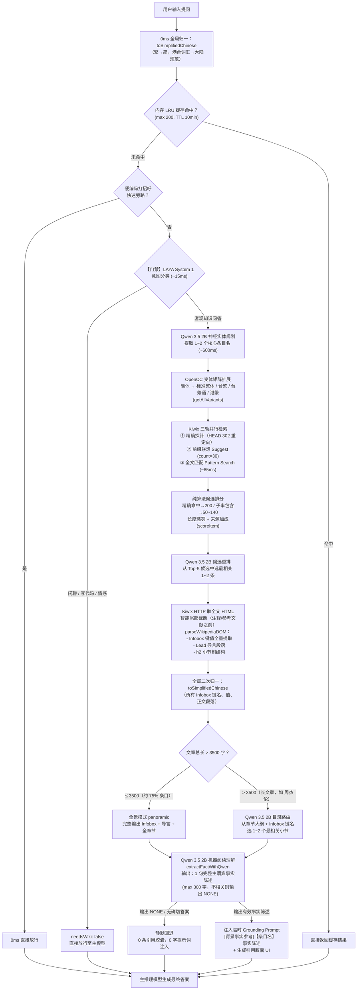

# SimpleUI

<p align="center">
  <a href="README.md"><b>简体中文</b></a> · <a href="README_EN.md">English</a>
</p>

<p align="center">
  <strong>专为 <a href="https://github.com/drumih/turbo-fieldfare">TurboFieldfare</a> 深度定制，全面兼容通用推理引擎的现代化轻量级 AI 客户端</strong>
</p>

<p align="center">
  React 19 · TypeScript · Vite · Tailwind CSS · KaTeX · 原生 macOS 双窗口 · 中英双语
</p>

---

## 目录

- [项目简介](#项目简介)
- [系统架构](#系统架构)
- [离线维基 RAG 流水线](#离线维基-rag-流水线)
- [上下文窗口管理](#上下文窗口管理)
- [推理引擎兼容](#推理引擎兼容)
- [快速启动](#快速启动)
- [项目结构](#项目结构)
- [开源协议](#开源协议)

---

## 项目简介

SimpleUI 是一款专为 [TurboFieldfare](https://github.com/drumih/turbo-fieldfare)（TTF）量身打造的高性能、极致轻量的前端客户端与 macOS 原生桌面应用。同时，基于对 OpenAI 兼容规范的全面支持，SimpleUI 亦可无缝连接 **Ollama、vLLM、llama.cpp server、LM Studio** 等主流本地与远程推理引擎。

相比 Open WebUI 等重型方案，SimpleUI 剥离了一切多余依赖（无需 Python 虚拟环境、FastAPI、SQLite 或向量数据库），前端静态体积极小，冷启动耗时 **< 300 ms**，内存占用仅约 **30 MB**。

SimpleUI 的核心技术亮点在于两大系统：

1. **端到端离线维基 RAG 流水线**：零截断、双门禁、全神经的本地知识库检索增强，完全在 Apple Silicon 本地运行，无需任何云端调用。
2. **两阶段动态上下文追踪**：精确区分生成中（峰值）与生成后（稳态）的上下文占用，并在界面上实时呈现。

---

## 系统架构

```
用户输入 (React 前端)
     │
     ▼
Node.js 代理服务器 (端口 31235)
     │
     ├──► 维基 RAG 服务 (wiki_service.js)
     │         │
     │         ├──► LAYA System 1 (端口 1236 · Apple Silicon MLX)
     │         ├──► Qwen 3.5 2B SLM (端口 1234 · LM Studio)
     │         └──► Kiwix 离线维基 (端口 31236 · ZIM 文件)
     │
     └──► 主推理模型 (端口 1235/1236 · TTF / Ollama / vLLM 等)
```

| 服务 | 端口 | 职责 |
| :--- | :--- | :--- |
| Node.js 代理 (`proxy.js`) | `31235` | SSE 透传、静态托管、动态路由 |
| Kiwix 离线百科 | `31236` | ZIM 文件读取、全文检索、条目 HTTP 服务 |
| Qwen 3.5 2B SLM | `1234` | 实体规划、意图路由、事实提炼、候选重排 |
| LAYA System 1 | `1236` | 快速意图分类（~15ms） |
| 主推理模型 | `1235` | 最终答案生成（TTF / 通用 OpenAI 接口） |

### 跨窗口同步

主窗口（Main Window）与 Spotlight 浮窗通过 `BroadcastChannel`（`syncChannel`）实时双向同步，消息类型包括：

| 消息类型 | 触发时机 | 内容 |
| :--- | :--- | :--- |
| `STREAM_TOKEN_PROGRESS` | 流式生成中（每 20 tokens） | `{ sessionId, liveTokens }` |
| `STREAM_CHUNK` | 每个 SSE delta | 增量文本 |
| `STREAM_DONE` | 生成完成 | 最终 metrics、cleanHistoryTokens |
| `STREAM_ABORT` | 用户停止 | sessionId |
| `SESSIONS_CHANGED` | 会话增删改 | - |
| `SETTINGS_CHANGED` | 设置变更 | 新配置 |

---

## 离线维基 RAG 流水线

SimpleUI 构建了一套**端到端、零截断、全神经**的离线本地知识库检索增强体系，完整运行于 Apple Silicon Mac，无任何云端依赖。

### 完整流程



### 各步骤技术说明

#### 步骤 0：全局归一（普通算法）

`toSimplifiedChinese(text)` 使用 **opencc-js** 进行两步级联转换：
1. `cn → t`：将大陆简体写法的港台词汇（如"记忆体"、"软体"）对齐到繁体词表索引（"記憶體"、"軟體"）
2. `twp → cn` + `hk → cn`：再将区域繁体与港台习语统一回大陆规范简体（"内存"、"软件"）

这一步同时作用于用户输入、Infobox 键值和正文段落，实现全链路词汇归一。

#### 步骤 1：LAYA 意图分类门禁（LAYA System 1 · 判别模型）

- **模型**：JHU mmBERT-base（多语言 ModernBERT，256,000 词表），运行于本地 Apple Silicon MLX
- **延迟**：~15 ms（原生 Metal GPU 加速）
- **判别方式**：`choice` 二分类：`chitchat_or_code`（放行）vs `knowledge_lookup`（进入 RAG）
- **意义**：将闲聊、写代码、情感交互等无需检索的请求在流水线最前端过滤，零算力浪费

#### 步骤 2：Qwen 3.5 2B 神经实体规划（小模型）

- **模型**：Qwen 3.5 2B（INT4 量化），运行于 LM Studio（端口 1234）
- **延迟**：~600 ms
- **任务**：从完整自然语言提问中理解语义，提炼最适合在百科全书中检索的规范实体名（1~2 个），输出纯 JSON `{"target_articles": [...]}`
- **特点**：完全语义驱动，无任何正则剥离或硬编码切片，容灾兜底为直接使用归一后的原始提问

#### 步骤 3：OpenCC 变体矩阵扩展（普通算法）

`getAllVariants(term)` 对规划出的每个实体名，通过 opencc-js 扩展出 5 种变体：

| 变体 | 示例（"鼠标"） | 示例（"周杰伦"） |
| :--- | :--- | :--- |
| 原词（大陆简体） | 鼠标 | 周杰伦 |
| 标准繁体 `cn→t` | 鼠標 | 周杰倫 |
| 台湾繁体 `cn→tw` | 滑鼠標 | 周杰倫 |
| 台湾繁体语 `cn→twp` | 滑鼠 | 周杰倫 |
| 香港繁体 `cn→hk` | 滑鼠 | 周杰倫 |

所有变体进入去重 Set 后用于后续检索，确保无论 ZIM 文件以何种字形索引条目都能命中。

#### 步骤 4：Kiwix 三轨并行检索（普通算法）

三路并发，结果去重合并：

| 轨道 | 接口 | 作用 |
| :--- | :--- | :--- |
| **精确探针** | `HEAD /content/{id}/{variant}` | 检测条目是否精确存在或跟随 302 重定向 |
| **Suggest 前缀联想** | `/suggest?term=...&count=30` | 标题前缀索引，覆盖精确及扩展标题 |
| **Pattern 全文检索** | `/search?pattern=...` | 全文匹配，~85ms，覆盖描述性查询（如"中国第一颗原子弹"→《596工程》） |

**候选打分**（普通算法，`scoreItem`）：
- 精确探针命中：+300
- 精确标题匹配：+200 / 大小写不敏感：+180
- 搜索词为标题的上义词（"日本首都" ⊃ "日本"）：+140
- 标题包含搜索词（完整前缀）：+110
- 搜索词包含标题 / 标题包含搜索词：+50~80
- 标题末尾匹配（"Amazon日本"）：+35
- 长度惩罚、来源加成（suggest rank 0: +30, rank 1: +20）

#### 步骤 5：Qwen 3.5 2B 候选重排（小模型）

- 从 Top-5 候选条目中，将完整用户提问与候选标题列表交给 Qwen 3.5 2B，输出最相关的 1~2 个标题（纯 JSON 数组），作为最终抓取顺序

#### 步骤 6：全文 HTML 抓取与 DOM 解析（普通算法）

`parseWikipediaDOM(html)` 流程：
1. **尾部截断**：从"注释"/"参考资料"/"外部链接"等章节起截断，丢弃无信息尾部
2. **噪音清洗**：移除 `<style>`, `<script>`, `<sup class="reference">`, navbox, figure/thumbnail
3. **Infobox 全量提取**：提取所有 `<th>/<td>` 行，键名 < 30 字且值 < 150 字则收录，**无行数上限**
4. **结构分割**：按第一个 `<h2>` 为界，分离 Lead 导言段（section0）与各小节（sections）
5. **段落提取**：所有 `<p>` 元素，清理 HTML 标签后长度 ≥ 20 字符收录

> **零截断原则**：全程不对段落进行字符截断，信息完整性由后续 SLM 过滤，而非机械切片。

#### 步骤 7：全局二次归一（普通算法）

将所有 Infobox 键名、键值、导言段落、各小节段落再次经过 `toSimplifiedChinese` 归一，消除 ZIM 文件本身以繁体字存储带来的词汇偏差。

#### 步骤 8：长文章路由（普通算法 + 小模型分支）

- **标准条目（≤ 3500 字，约 75%）**：`panoramic` 模式，完整输出 Infobox + 导言 + 全章节，送入 SLM 理解
- **超长条目（> 3500 字，如"周杰伦"、"中国"）**：`routed` 模式，先由 Qwen 3.5 2B 从章节大纲与 Infobox 键名中选出 1~2 个最相关小节（max 50 tokens），再仅将这些段落送入 SLM

#### 步骤 9：Qwen 3.5 2B 机器阅读理解（小模型）

`extractFactWithQwen(query, articleTitle, context)` 进行针对性事实提炼：
- 指令：若正文包含能正面回答问题的确切事实，输出一句完整主谓宾陈述（≤ 300 字）；否则**仅输出 `NONE`**
- 彻底禁止提取与问题无关的条目生平或介绍性背景
- 输出 `NONE` / 函数返回 `null` → 该条目被丢弃，触发静默回退
- 输出有效事实陈述 → 构建 `[背景事实参考]` 临时 Grounding Prompt，注入当次请求（**不存入持久历史**）

**Qwen MRC 的 `NONE` 输出机制即是整条流水线的最终过滤层**，不存在独立的后置门禁步骤。

### 核心设计原则

1. **零截断**：正文内容完整传递，过滤由 SLM 语义判断，非机械字符截断
2. **零污染**：Grounding Prompt 为临时 ephemeral 包装，严格不写入持久对话历史
3. **零正则剥离**：实体规划完全语义驱动，不进行破坏语义的人工关键词提取
4. **神经门禁**：LAYA System 1（~15ms）前置拦截无关请求；Qwen MRC 以 `NONE` 输出作为最终事实过滤
5. **静默回退**：任一环节未通过，均静默退出，主模型依靠通用知识作答，绝不注入噪音

---

## 上下文窗口管理

### 两阶段动态追踪（潮起 / 潮落）

```
生成中 (Phase 1 - 潮起)：
  liveStreamingTokens = initialPromptTokens + 已生成 tokens
  ← 每 20 个 token 刷新一次，通过 BroadcastChannel 同步双窗口

生成后 (Phase 2 - 潮落)：
  liveStreamingTokens = null
  displayTokens = persistentHistoryTokens (useMemo 计算)
  ← 只统计持久化历史（用户问题 + 助手最终回答），自然回落
```

**为什么两阶段是必要的：**

生成中，上下文包含：持久历史 + RAG Grounding Prompt（~1,500 tokens）+ 思考模型 reasoningContent（最多 ~3,000 tokens）。生成后，下一轮 `wireMessages` 只发送 `msg.content`，不含 `reasoningContent` 和 RAG 提示词，实际上下文大幅下降。

旧方案将 `metrics.totalTokens`（~5,000）直接存入 `session.contextUsed`，导致下一轮圆环虚高不回落。新方案在 `onDone` 时用 `estimateHistoryTokens` 计算纯净历史作为 `contextUsed`，圆环在生成结束后自然回落。

### Token 估算器（`src/utils/token.ts`）

```typescript
// CJK 字符：~0.75 tokens/字（针对 Qwen/Gemma tokenizer 调优）
// 非 CJK 字符：~1 token / 3.8 chars
// 每条消息 chat template 固定开销：+4 tokens
// 图片（vision）：+576 tokens/张（标准 vision budget）
// System prompt 计入基线

estimateTextTokens(text: string): number
estimateHistoryTokens(messages: Array<Partial<ChatMessage>>, systemPrompt?: string): number
```

`estimateHistoryTokens` **仅统计**：用户 `content`、助手 `content`（最终答案）、图片附件。  
**明确排除**：`reasoningContent`（思考过程）、ephemeral RAG Grounding Prompt。

### 圆环显示规则

| 窗口 | 生成中 | 生成后 |
|---|---|---|
| **主窗口 (大)** | `liveStreamingTokens` 实时驱动 + 右侧显示余量百分比 | `persistentHistoryTokens` 驱动 + 右侧百分比 |
| **Spotlight (小)** | `liveStreamingTokens` 实时驱动，仅圆环 | `persistentHistoryTokens` 驱动，仅圆环 |

余量百分比格式：`≥ 99.95%` 显示 `100%`，否则显示 `X.X%`（如 `98.6%`）。

---

## 推理引擎兼容

SimpleUI 最深度适配 TurboFieldfare (TTF)，同时完整兼容通用 OpenAI API 规范：

| 推理服务 | 端口 | 深度思考 | 视觉 |
| :--- | :--- | :--- | :--- |
| **TurboFieldfare (TTF)** | `1235` | ✅ 原生（`chat_template_kwargs` + `reasoning_effort`） | ✅ 自动识别 |
| **Ollama** | `11434` | 依赖模型 template | 依赖模型 |
| **vLLM** | `8000` | 依赖模型 template | 依赖模型 |
| **llama.cpp server** | `8080` | 依赖模型 template | 依赖模型 |
| **LM Studio** | `1234` | 依赖模型 template | 依赖模型 |

> **工作机制**：请求通过 `x-target-port` 标头动态路由，切换推理引擎无需重启代理。

---

## 快速启动

### 前提条件
- Node.js ≥ 18
- 本地或局域网已启动推理服务（推荐搭配 [TurboFieldfare](https://github.com/drumih/turbo-fieldfare) 默认端口 `1235`）

### 方式一：一键启动（推荐）
```bash
./start.sh
```
自动探测推理服务、安装依赖（首次）、编译构建、启动代理并打开 `http://127.0.0.1:31235`。

### 方式二：开发热重载
```bash
./start.sh dev
# 或
npm run dev
```

### 方式三：编译 macOS 桌面应用
```bash
./build_mac_app.sh install
```
编译并安装至 `/Applications/SimpleUI.app`，支持全局热键 `⌥ Option + Space` 唤起 Spotlight 浮窗。

---

## 项目结构

```
SimpleUI/
├── server/
│   ├── proxy.js              # Node.js 代理服务器（端口 31235）
│   │                         #   SSE 透传、静态托管、动态端口路由
│   ├── wiki_service.js       # 离线 RAG 流水线核心
│   │                         #   LAYA 双门禁、Qwen 3.5 2B、Kiwix 三轨检索
│   │                         #   parseWikipediaDOM、assembleArticleContext
│   │                         #   toSimplifiedChinese、getAllVariants (OpenCC)
│   └── laya_mlx_server.py    # LAYA System 1 MLX 加速服务（端口 1236）
│
├── mac_app/                  # macOS 原生双窗口包装层（Swift + WebKit）
│   ├── src/                  # AppDelegate、HotKey、WindowControllers
│   └── Resources/            # Info.plist、AppIcon.icns
│
└── src/
    ├── App.tsx               # 顶层状态机、会话管理、liveStreamingTokens
    ├── services/
    │   ├── api.ts            # 推理引擎通信、SSE 解析、onTokenProgress 回调
    │   └── storage.ts        # localStorage 持久化、BroadcastChannel
    ├── utils/
    │   └── token.ts          # 离线 Token 估算器（CJK + 非CJK + 图片）
    └── components/
        ├── ContextRing.tsx   # SVG 动态上下文圆环（showRemainingPercent 选项）
        ├── ChatInput.tsx     # 复合输入框（深度思考切换、图片、发送/停止）
        ├── SpotlightView.tsx # Spotlight 浮窗完整状态机
        ├── ChatView.tsx      # 主对话视窗
        ├── MessageItem.tsx   # 单条消息（思考折叠、Markdown、KaTeX）
        └── SettingsModal.tsx # 参数配置、推理端口、语言设置
```

---

## 开源协议

本项目基于 [Apache License 2.0](LICENSE) 开源。
