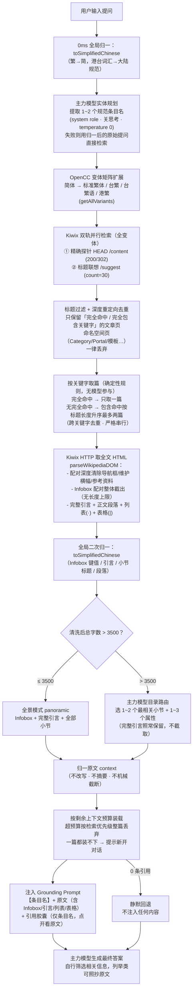

# SimpleUI

<p align="center">
  <a href="README.md"><b>简体中文</b></a> · <a href="README_EN.md">English</a>
</p>

<p align="center">
  <strong>专为 <a href="https://github.com/drumih/turbo-fieldfare">TurboFieldfare</a> 深度定制，全面兼容通用推理引擎的现代化轻量级 AI 客户端</strong>
</p>

<p align="center">
  React 19 · TypeScript · Vite · Tailwind CSS · KaTeX · 原生 macOS 双窗口 · 中英双语
</p>

---

## 目录

- [项目简介](#项目简介)
- [系统架构](#系统架构)
- [离线维基 RAG 流水线](#离线维基-rag-流水线)
- [上下文窗口管理](#上下文窗口管理)
- [推理引擎兼容](#推理引擎兼容)
- [快速启动](#快速启动)
- [项目结构](#项目结构)
- [开源协议](#开源协议)

---

## 项目简介

SimpleUI 是一款专为 [TurboFieldfare](https://github.com/drumih/turbo-fieldfare)（TTF）量身打造的高性能、极致轻量的前端客户端与 macOS 原生桌面应用。同时，基于对 OpenAI 兼容规范的全面支持，SimpleUI 亦可无缝连接 **Ollama、vLLM、llama.cpp server、LM Studio** 等主流本地与远程推理引擎。

相比 Open WebUI 等重型方案，SimpleUI 剥离了一切多余依赖（无需 Python 虚拟环境、FastAPI、SQLite 或向量数据库），前端静态体积极小，冷启动耗时 **< 300 ms**，内存占用仅约 **30 MB**。

SimpleUI 的核心技术亮点在于两大系统：

1. **端到端离线维基 RAG 流水线**：零截断、**去生成化检索**（原文直注，不由小模型改写事实）、单模型负责全部语义判断，完全在 Apple Silicon 本地运行，无需任何云端调用。
2. **两阶段动态上下文追踪**：精确区分生成中（峰值）与生成后（稳态）的上下文占用，并在界面上实时呈现。

---

## 系统架构

```
用户输入 (React 前端)
     │
     ▼
Node.js 代理服务器 (端口 31235)
     │
     ├──► 维基 RAG 服务 (wiki_service.js)
     │         │
     │         ├──► Kiwix 离线维基 (端口 31236 · ZIM 文件)
     │         └──► 主力模型 (端口 1235) ← 实体规划 / 长文目录路由
     │
     └──► 主推理模型 (端口 1235 · TTF / Ollama / vLLM 等) ← 最终答案生成
```

| 服务 | 端口 | 职责 |
| :--- | :--- | :--- |
| Node.js 代理 (`proxy.js`) | `31235` | SSE 透传、静态托管、动态路由、知识库 API |
| Kiwix 离线百科 | `31236` | ZIM 文件读取、标题联想、条目 HTTP 服务 |
| 主推理模型 | `1235` | 实体规划、长文目录路由、最终答案生成 |

> 旧版链路中的两个辅助服务均已移除：
> **LAYA System 1**（端口 1236）意图门禁——实测会把约 1/3 的知识类提问误判为闲聊而整条链路拦截；
> **Qwen 3.5 2B**（端口 1234）小模型——曾承担实体规划、候选重排与事实改写（MRC），
> 现已分别被主力模型规划、确定性取篇规则与「原文直注」取代。
> 现在整条链路只依赖 Kiwix 与主力模型两个服务。

### 跨窗口同步

主窗口（Main Window）与 Spotlight 浮窗通过 `BroadcastChannel`（`syncChannel`）实时双向同步，消息类型包括：

| 消息类型 | 触发时机 | 内容 |
| :--- | :--- | :--- |
| `STREAM_TOKEN_PROGRESS` | 流式生成中（每 20 tokens） | `{ sessionId, liveTokens }` |
| `STREAM_CHUNK` | 每个 SSE delta | 增量文本 |
| `STREAM_DONE` | 生成完成 | 最终 metrics、cleanHistoryTokens |
| `STREAM_ABORT` | 用户停止 | sessionId |
| `SESSIONS_CHANGED` | 会话增删改 | - |
| `SETTINGS_CHANGED` | 设置变更 | 新配置 |

---

## 离线维基 RAG 流水线

SimpleUI 构建了一套**端到端、零截断、去生成化检索**的离线本地知识库检索增强体系，完整运行于 Apple Silicon Mac，无任何云端依赖。

核心思想：**检索链路里不让任何模型"生成"检索键或"改写"正文**。条目名不是模型编出来的（直接用原提问检索），注入的也不是模型摘要（直接注入归一后的原文）——没有改写就没有编造。

### 完整流程



### 各步骤技术说明

#### 步骤 0：全局归一（OpenCC）

`toSimplifiedChinese(text)` 使用 **opencc-js** 进行两步级联转换：
1. `cn → t`：将大陆简体写法的港台词汇（如"记忆体"、"软体"）对齐到繁体词表索引（"記憶體"、"軟體"）
2. `twp → cn` + `hk → cn`：再将区域繁体与港台习语统一回大陆规范简体（"内存"、"软件"）

这一步同时作用于用户提问、Infobox 键值、小节标题与正文段落，实现全链路词汇归一。
所有中文简繁与港台用语转换**统一由 OpenCC 承担**，不使用任何自写映射表。

#### 步骤 1：主力模型实体规划

- **模型**：主力推理模型（默认 Gemma 4 26B-A4B，端口 1235）
- **调用方式**：规则放 `system`、示例与提问放 `user`（Gemma 4 原生支持 system role）；关闭思考；`temperature=0`（实测与官方建议的 1.0 在 12 个全新问题上质量一致，但 1.0 存在规划结果跳变）
- **任务**：从完整自然语言提问中提炼 1~2 个规范条目名，输出纯 JSON `{"target_articles": [...]}`
- **防凑数**：提示词显式要求"默认只给 1 个，仅当确实涉及两个独立实体才给 2 个，严禁凑数推测"
- **无回退**：不做任何小模型兜底；规划失败时直接用归一后的原始提问检索
- **性能**：主力模型 prefill ≈ 30ms/token，规划一次约 9s；提示词长度是唯一有效杠杆（无有效前缀缓存）

#### 步骤 2：OpenCC 变体矩阵扩展

`getAllVariants(term)` 对规划出的每个实体名，通过 opencc-js 扩展出全部字形变体：

| 变体 | 示例（"鼠标"） | 示例（"周杰伦"） |
| :--- | :--- | :--- |
| 原词（大陆简体） | 鼠标 | 周杰伦 |
| 标准繁体 `cn→t` | 鼠標 | 周杰倫 |
| 台湾繁体 `cn→tw` | 滑鼠標 | 周杰倫 |
| 台湾繁体语 `cn→twp` | 滑鼠 | 周杰倫 |
| 香港繁体 `cn→hk` | 滑鼠 | 周杰倫 |

**全部变体**进入去重 Set 后用于后续检索（旧版只取前 2~4 个，会漏检），确保无论 ZIM 文件以何种字形索引条目都能命中。

#### 步骤 3：Kiwix 标题检索 + 过滤 + 深度重定向去重

只走**标题轨道**（不使用全文检索）：

| 轨道 | 接口 | 作用 |
| :--- | :--- | :--- |
| **精确探针** | `HEAD /content/{id}/{variant}` | 检测条目是否精确存在或跟随 302 重定向（命中即保留） |
| **标题联想** | `/suggest?content=...&term=...&count=30` | 标题索引，覆盖精确及扩展标题 |

随后三步收敛：
1. **标题过滤**：只保留条目名「完全等于」或「完全包含」任一关键字变体的文章页；`Category:`、`Portal:`、`Template:` 等命名空间页一律丢弃
2. **深度重定向**：对每个候选发起 `HEAD`（`redirect:manual`），解析出 Kiwix 的规范路径——避免同一文章的多个别名（如「康托」→「格奥尔格·康托尔」）被当成多篇
3. **按规范路径去重**，最多保留 6 篇

#### 步骤 4：按关键字取篇（确定性规则，无模型参与）

每个关键字**独立取篇**，规则完全确定性：

| 情形 | 行为 |
| :--- | :--- |
| 存在「完全命中」条目 | **只取一篇**（按顺序尝试，取第一篇成功抓到正文的） |
| 无完全命中 | 「包含关键字」条目按**标题长度升序**（额外字越少越靠前）**最多取两篇** |
| 连包含命中都没有 | 该关键字一篇都不放，不影响其他关键字 |

- 去重在检索阶段已完成（按规范路径），此处再做跨关键字去重
- 完全命中 = 精确探针命中，或标题与关键字变体逐字相等
- 两个关键字 → 最多两篇；全部串行处理（主力模型不支持并发）

#### 步骤 5：全文 HTML 抓取与 DOM 解析

`parseWikipediaDOM(html)` 流程：

1. **尾部截断**：从「注释/参考文献/外部链接/参见/延伸阅读」小节起截断（兼容 h2 与 h3 两级标题）
2. **配对深度清除**（`removeElementsByClass`）：导航框、侧边栏、维护横幅（ambox）、参考资料包裹层等多层嵌套结构，必须按 `<tag>`/`</tag>` 配对扫描整体移除——非贪婪正则会停在第一个闭合标签处提前断开，把内部的 `<li>`/`<td>` 漏进正文
3. **不可见内容清除**：MediaWiki 排序键（`sortkey`，如 `7008299792458000000♠`）、`display:none` 元素、`[来源请求]` 类标记——这些浏览器不渲染，但纯文本抽取会带出来
4. **Infobox 配对整体截出**：Infobox 常嵌套子表格，同样按 `<table>`/`</table>` 配对扫描，所有 `<th>/<td>` 行**无长度上限**全量收录
5. **结构分割**：按第一个 `<h2>` 为界，分离完整引言（section0）与各小节（sections）
6. **按序抽取内容块**：`<p>` 段落、`<ul>/<ol>` 列表（转「· 条目」行）、`<table>` 表格（转「| 单元格 | 单元格 |」管道表），保持原文出现顺序，**无任何长度过滤**

> **零截断原则**：全程不对内容做字符截断；清洗只针对"页面上不渲染的元素"与"非文章页"，正文一律保留。

#### 步骤 6：全局二次归一

将所有 Infobox 键名、键值、小节标题、引言与正文段落再次经过 `toSimplifiedChinese` 归一，消除 ZIM 文件本身以繁体字存储带来的字形与词汇偏差。实测繁体条目（《周杰倫》）输出 0 繁体字形残留。

#### 步骤 7：长文章路由

- **标准条目（≤ 3500 字，约 75%）**：`panoramic` 模式，完整输出 Infobox + 完整引言 + 全部小节
- **超长条目（> 3500 字）**：`routed` 模式，由**主力模型**从章节大纲与 Infobox 键名中选出 1~2 个最相关小节与 1~3 个属性；这些小节的**完整段落**全部拼入，**完整引言照常保留**，不做任何截取

#### 步骤 8：原文直注（无 MRC）

旧版在此处有一个「机器阅读理解」环节：让小模型读正文、压缩成一句事实陈述。实测它会**编造**（在《康托尔集》里编出"哥德巴赫猜想是由格奥尔格·康托尔提出的"）。该环节已整体移除。

现在：`assembleArticleContext` 产出的归一原文**直接注入**给主力模型，由它自行定位相关信息、结合自身知识生成答案：
- 没有改写就没有编造
- 列举类问题（"列出所有作品"）可直接照抄原文列表
- 引用胶囊点击后，抽屉内原版维基页面上方会展示这份纯文字原文，**可核验**

#### 步骤 9：上下文预算装载

前端按 `maxContext - maxTokens` 估算可用 token（中文字符 ≈ 1 token，×1.5 折算字符），作为 `budgetChars` 传给后端。后端按检索优先级依次装载各条目，**超预算时整篇丢弃，绝不从中间截断**。这是一条自适应的资源约束——上下文开得越大，预算越大，实际不会触发；若一篇都装不下（对话拖得过长），后端返回 `contextOverflow` 信号，前端提示用户新建对话。

#### 注入提示词

```
[百科原文参考]
以下是从离线知识库中检索到的与用户问题相关的百科条目内容（含基本档案、引言与相关小节）。

【条目名】
<原文>

[回答指引]
1. 【自行筛选】：自行定位原文中真正与问题相关的部分，忽略其余。
2. 【事实锚定】：将其中出现的事实、时间、人物与数据作为真实性基石；若信息不完整，可结合你自身的知识补充展开。
3. 【按需照抄】：若用户要求列举类内容（例如"列出所有作品/所有奖项"），请忠实照抄原文中的对应列表，不要擅自删减或概括。
4. 【注明出处】：回答中请说明引用了哪篇百科条目。

[用户问题]
<原始提问>
```

该 Grounding Prompt 为临时 ephemeral 包装，**不写入持久对话历史**。

### 核心设计原则

1. **去生成化检索**：检索键与注入内容都不由模型"生成"——原提问直接检索、原文直接注入。没有改写就没有编造。
2. **零截断**：正文内容完整传递；唯一的取舍是"整篇装载/整篇丢弃"（上下文预算），绝不从中间截断。
3. **零污染**：Grounding Prompt 为临时 ephemeral 包装，严格不写入持久对话历史。
4. **零机械规则**：不做关键词正则剥离、不做硬编码打招呼旁路、不做事实相关性正则过滤；中文简繁转换统一交给 OpenCC。
5. **弃权优先**：任一环节拿不到结果即静默退出，主模型依靠通用知识作答，绝不注入噪音。宁可漏引，不可错引。
6. **配对扫描**：一切 HTML 结构性删除（导航框、Infobox、参考资料）都按标签配对深度扫描，绝不使用非贪婪正则处理嵌套结构。
7. **单模型串行**：链路中只有主力模型承担全部语义判断（规划/路由/生成），且严格串行调用——主力模型不支持多路并发；无内存缓存，结果实时计算。

### 知识库服务开关

设置中的「启用知识库服务」是**服务级总开关**（持久化于 `wiki_config.json`）：

| 总开关 | ZIM 就绪 | 对话 📚 按钮 | 左下角服务行 |
| :--- | :--- | :--- | :--- |
| 关闭 | 任意 | 不渲染 | 整行消失（服务进程被杀） |
| 开启 | 是 | 显示 · 可点 | 显示 ready（含条目数） |
| 开启 | 否 | 显示 · 禁用 | 显示 offline |

会话级 📚 开关默认关闭（知识库检索目前处于早期实验阶段），需手动点亮。

---

## 上下文窗口管理

### 两阶段动态追踪（潮起 / 潮落）

```
生成中 (Phase 1 - 潮起)：
  liveStreamingTokens = initialPromptTokens + 已生成 tokens
  ← 每 20 个 token 刷新一次，通过 BroadcastChannel 同步双窗口

生成后 (Phase 2 - 潮落)：
  liveStreamingTokens = null
  displayTokens = persistentHistoryTokens (useMemo 计算)
  ← 只统计持久化历史（用户问题 + 助手最终回答），自然回落
```

**为什么两阶段是必要的：**

生成中，上下文包含：持久历史 + RAG Grounding Prompt（体积随条目而定，受 `budgetChars` 预算约束，默认上限约 `maxContext - maxTokens`）+ 思考模型 reasoningContent（最多 ~3,000 tokens）。生成后，下一轮 `wireMessages` 只发送 `msg.content`，不含 `reasoningContent` 和 RAG 提示词，实际上下文大幅下降。

旧方案将 `metrics.totalTokens`（~5,000）直接存入 `session.contextUsed`，导致下一轮圆环虚高不回落。新方案在 `onDone` 时用 `estimateHistoryTokens` 计算纯净历史作为 `contextUsed`，圆环在生成结束后自然回落。

### Token 估算器（`src/utils/token.ts`）

```typescript
// CJK 字符：~0.75 tokens/字（针对 Qwen/Gemma tokenizer 调优）
// 非 CJK 字符：~1 token / 3.8 chars
// 每条消息 chat template 固定开销：+4 tokens
// 图片（vision）：+576 tokens/张（标准 vision budget）
// System prompt 计入基线

estimateTextTokens(text: string): number
estimateHistoryTokens(messages: Array<Partial<ChatMessage>>, systemPrompt?: string): number
```

`estimateHistoryTokens` **仅统计**：用户 `content`、助手 `content`（最终答案）、图片附件。  
**明确排除**：`reasoningContent`（思考过程）、ephemeral RAG Grounding Prompt。

### 圆环显示规则

| 窗口 | 生成中 | 生成后 |
|---|---|---|
| **主窗口 (大)** | `liveStreamingTokens` 实时驱动 + 右侧显示余量百分比 | `persistentHistoryTokens` 驱动 + 右侧百分比 |
| **Spotlight (小)** | `liveStreamingTokens` 实时驱动，仅圆环 | `persistentHistoryTokens` 驱动，仅圆环 |

余量百分比格式：`≥ 99.95%` 显示 `100%`，否则显示 `X.X%`（如 `98.6%`）。

---

## 推理引擎兼容

SimpleUI 最深度适配 TurboFieldfare (TTF)，同时完整兼容通用 OpenAI API 规范：

| 推理服务 | 端口 | 深度思考 | 视觉 |
| :--- | :--- | :--- | :--- |
| **TurboFieldfare (TTF)** | `1235` | ✅ 原生（`chat_template_kwargs` + `reasoning_effort`） | ✅ 自动识别 |
| **Ollama** | `11434` | 依赖模型 template | 依赖模型 |
| **vLLM** | `8000` | 依赖模型 template | 依赖模型 |
| **llama.cpp server** | `8080` | 依赖模型 template | 依赖模型 |
| **LM Studio** | `1234` | 依赖模型 template | 依赖模型 |

> **工作机制**：请求通过 `x-target-port` 标头动态路由，切换推理引擎无需重启代理。

---

## 快速启动

### 前提条件
- Node.js ≥ 18
- 本地或局域网已启动推理服务（推荐搭配 [TurboFieldfare](https://github.com/drumih/turbo-fieldfare) 默认端口 `1235`）

### 方式一：一键启动（推荐）
```bash
./start.sh
```
自动探测推理服务、安装依赖（首次）、编译构建、启动代理并打开 `http://127.0.0.1:31235`。

### 方式二：开发热重载
```bash
./start.sh dev
# 或
npm run dev
```

### 方式三：编译 macOS 桌面应用
```bash
./build_mac_app.sh install
```
编译并安装至 `/Applications/SimpleUI.app`，支持全局热键 `⌥ Option + Space` 唤起 Spotlight 浮窗。

---

## 项目结构

```
SimpleUI/
├── server/
│   ├── proxy.js              # Node.js 代理服务器（端口 31235）
│   │                         #   SSE 透传、静态托管、动态端口路由、知识库 API
│   ├── wiki_service.js       # 离线 RAG 流水线核心
│   │                         #   主力模型规划与目录路由、Kiwix 标题检索与重定向去重
│   │                         #   parseWikipediaDOM（配对深度清洗/列表/表格）
│   │                         #   assembleArticleContext、toSimplifiedChinese (OpenCC)
│   └── laya_mlx_server.py    # LAYA System 1 服务（已从链路移除，文件保留备查）
│
├── mac_app/                  # macOS 原生双窗口包装层（Swift + WebKit）
│   ├── src/                  # AppDelegate、HotKey、WindowControllers
│   └── Resources/            # Info.plist、AppIcon.icns
│
└── src/
    ├── App.tsx               # 顶层状态机、会话管理、liveStreamingTokens
    ├── services/
    │   ├── api.ts            # 推理引擎通信、SSE 解析、onTokenProgress 回调
    │   └── storage.ts        # localStorage 持久化、BroadcastChannel
    ├── utils/
    │   └── token.ts          # 离线 Token 估算器（CJK + 非CJK + 图片）
    └── components/
        ├── ContextRing.tsx   # SVG 动态上下文圆环（showRemainingPercent 选项）
        ├── ChatInput.tsx     # 复合输入框（深度思考切换、图片、发送/停止）
        ├── SpotlightView.tsx # Spotlight 浮窗完整状态机
        ├── ChatView.tsx      # 主对话视窗
        ├── MessageItem.tsx   # 单条消息（思考折叠、Markdown、KaTeX）
        └── SettingsModal.tsx # 参数配置、推理端口、语言设置
```

---

## 开源协议

本项目基于 [Apache License 2.0](LICENSE) 开源。
