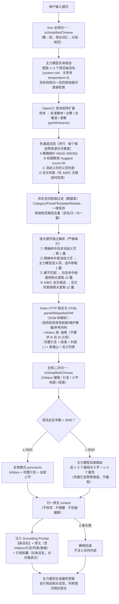

# SimpleUI

<p align="center">
  <a href="README.md"><b>简体中文</b></a> · <a href="README_EN.md">English</a>
</p>

<p align="center">
  <strong>专为 <a href="https://github.com/drumih/turbo-fieldfare">TurboFieldfare</a> 深度定制，全面兼容通用推理引擎的现代化轻量级 AI 客户端</strong>
</p>

<p align="center">
  React 19 · TypeScript · Vite · Tailwind CSS · KaTeX · 原生 macOS 双窗口 · 中英双语
</p>

---

## 目录

- [项目简介](#项目简介)
- [系统架构](#系统架构)
- [离线维基 RAG 流水线](#离线维基-rag-流水线)
- [上下文窗口管理](#上下文窗口管理)
- [推理引擎兼容](#推理引擎兼容)
- [快速启动](#快速启动)
- [项目结构](#项目结构)
- [开源协议](#开源协议)

---

## 项目简介

SimpleUI 是一款专为 [TurboFieldfare](https://github.com/drumih/turbo-fieldfare)（TTF）量身打造的高性能、极致轻量的前端客户端与 macOS 原生桌面应用。同时，基于对 OpenAI 兼容规范的全面支持，SimpleUI 亦可无缝连接 **Ollama、vLLM、llama.cpp server、LM Studio** 等主流本地与远程推理引擎。

相比 Open WebUI 等重型方案，SimpleUI 剥离了一切多余依赖（无需 Python 虚拟环境、FastAPI、SQLite 或向量数据库），前端静态体积极小，冷启动耗时 **< 300 ms**，内存占用仅约 **30 MB**。

SimpleUI 的核心技术亮点在于两大系统：

1. **端到端离线维基 RAG 流水线**：零截断、**原文直注**（检索键由主力模型规划，注入正文不经任何模型改写）、单模型承担全部语义判断，完全在 Apple Silicon 本地运行，无需任何云端调用。
2. **两阶段动态上下文追踪**：精确区分生成中（峰值）与生成后（稳态）的上下文占用，并在界面上实时呈现。

---

## 系统架构

```
用户输入 (React 前端)
     │
     ▼
Node.js 代理服务器 (端口 31235)
     │
     ├──► 维基 RAG 服务 (wiki_service.js)
     │         │
     │         ├──► Kiwix 离线维基 (端口 31236 · ZIM 文件)
     │         └──► 主力模型 (端口 1235) ← 实体规划 / 长文目录路由
     │
     └──► 主推理模型 (端口 1235 · TTF / Ollama / vLLM 等) ← 最终答案生成
```

| 服务 | 端口 | 职责 |
| :--- | :--- | :--- |
| Node.js 代理 (`proxy.js`) | `31235` | SSE 透传、静态托管、动态路由、知识库 API |
| Kiwix 离线百科 | `31236` | ZIM 文件读取、标题联想、条目 HTTP 服务 |
| 主推理模型 | `1235` | 实体规划、长文目录路由、最终答案生成 |

> 旧版链路中的两个辅助服务均已移除：
> **LAYA System 1**（端口 1236）意图门禁——实测会把约 1/3 的知识类提问误判为闲聊而整条链路拦截；
> **Qwen 3.5 2B**（端口 1234）小模型——曾承担实体规划、候选重排与事实改写（MRC），
> 现已分别被主力模型规划、确定性取篇规则与「原文直注」取代。
> 现在整条链路只依赖 Kiwix 与主力模型两个服务。

### 跨窗口同步

主窗口（Main Window）与 Spotlight 浮窗通过 `BroadcastChannel`（`syncChannel`）实时双向同步，消息类型包括：

| 消息类型 | 触发时机 | 内容 |
| :--- | :--- | :--- |
| `STREAM_TOKEN_PROGRESS` | 流式生成中（每 20 tokens） | `{ sessionId, liveTokens }` |
| `STREAM_CHUNK` | 每个 SSE delta | 增量文本 |
| `STREAM_DONE` | 生成完成 | 最终 metrics、cleanHistoryTokens |
| `STREAM_ABORT` | 用户停止 | sessionId |
| `SESSIONS_CHANGED` | 会话增删改 | - |
| `SETTINGS_CHANGED` | 设置变更 | 新配置 |
| `STREAM_QUERY` | 浮窗打开/聚焦时，主窗回灌进行中的流 | 重放中的 chunk |
| `LOAD_SESSION_IN_SPOTLIGHT` | 主窗「收起为浮窗」 | sessionId |

---

## 离线维基 RAG 流水线

SimpleUI 构建了一套**端到端、零截断、原文直注**的离线本地知识库检索增强体系，完整运行于 Apple Silicon Mac，无任何云端依赖。

核心思想：**注入正文不经任何模型改写**。条目名由主力模型从提问中规划出 1~2 个规范名称（规划失败则用归一后的原提问直接检索）；注入的不是模型摘要，而是抓取并归一后的原文——没有改写就没有编造。

### 完整流程


```mermaid
flowchart TD
    Q["用户输入提问"] --> NORM["0ms 全局归一：toSimplifiedChinese\n（繁→简，港台词汇→大陆规范）"]
    NORM --> PLAN["主力模型实体规划\n提取 1~2 个规范条目名\n(system role · 关思考 · temperature 0)\n失败则用归一后的原始提问直接检索"]

    PLAN --> VARIANTS["OpenCC 变体矩阵扩展\n简体 → 标准繁体 / 台繁 / 台繁语 / 港繁\n(getAllVariants)"]
    VARIANTS --> RECALL["多通道召回（并行 · 每个候选带来源与可靠度）\nA 精确探针 HEAD 200/302\nB 标题联想 /suggest count=30\nC 消歧义页的义项列表\nD 全文检索（仅 A/B/C 无候选时启用）"]
    RECALL --> FILTER["命名空间前缀过滤（数据表）\nCategory/Portal/Template/Module… 一律丢弃\n再按规范路径去重（别名归一为一篇）"]
    FILTER --> SELECT["按关键字独立解析（严格串行）\n① 精确命中且非消歧义页 → 取 1 篇\n② 精确命中是消歧义页 → 主力模型选义项，选中即取 1 篇\n③ 都不匹配 → 包含命中按通用相关度取 ≤2 篇\n④ A/B/C 全无候选 → 全文检索按相关度取 ≤2 篇"]
    SELECT --> DOM["Kiwix HTTP 取全文 HTML\nparseWikipediaDOM（DOM 树解析）：\n  - 结构性剪枝导航框/维护横幅/参考资料\n  - Infobox 按 <tr> 抽取（不要求 th 在 td 之前）\n  - 完整引言 + 段落 + 列表(·) + 表格(|) + 定义列表"]
    DOM --> NORM2["全局二次归一：toSimplifiedChinese\n（Infobox 键值 / 引言 / 小节标题 / 段落）"]
    NORM2 --> BRANCH{"清洗后总字数 > 3500？"}
    BRANCH -->|"≤ 3500"| PANO["全景模式 panoramic\nInfobox + 完整引言 + 全部小节"]
    BRANCH -->|"> 3500"| ROUTE["主力模型目录路由\n选 1~2 个最相关小节 + 1~3 个属性\n（完整引言照常保留，不截取）"]
    PANO --> CTX["归一原文 context\n（不改写 · 不摘要 · 不机械截断）"]
    ROUTE --> CTX
    CTX --> INJECT["注入 Grounding Prompt\n【条目名】+ 原文（含 Infobox/引言/列表/表格）\n+ 引用胶囊（仅条目名，点开看原文）"]
    CTX -->|"0 条引用"| SILENT["静默回退\n不注入任何内容"]

    INJECT --> LLM["主力模型生成最终答案\n自行筛选相关信息，列举类可照抄原文"]
    SILENT --> LLM
```

### 各步骤技术说明

#### 步骤 0：全局归一（OpenCC）

`toSimplifiedChinese(text)` 使用 **opencc-js** 进行两步级联转换：
1. `cn → t`：将大陆简体写法的港台词汇（如"记忆体"、"软体"）对齐到繁体词表索引（"記憶體"、"軟體"）
2. `twp → cn` + `hk → cn`：再将区域繁体与港台习语统一回大陆规范简体（"内存"、"软件"）

这一步同时作用于用户提问、Infobox 键值、小节标题与正文段落，实现全链路词汇归一。
所有中文简繁与港台用语转换**统一由 OpenCC 承担**，不使用任何自写映射表。

#### 步骤 1：主力模型实体规划

- **模型**：主力推理模型（默认 Gemma 4 26B-A4B，端口 1235）
- **调用方式**：规则放 `system`、示例与提问放 `user`（Gemma 4 原生支持 system role）；关闭思考；`temperature=0`（实测与官方建议的 1.0 在 12 个全新问题上质量一致，但 1.0 存在规划结果跳变）
- **任务**：从完整自然语言提问中提炼 1~2 个规范条目名，输出纯 JSON `{"target_articles": [...]}`
- **防凑数**：提示词显式要求"默认只给 1 个，仅当确实涉及两个独立实体才给 2 个，严禁凑数推测"
- **无回退**：不做任何小模型兜底；规划失败时直接用归一后的原始提问检索
- **性能**：主力模型 prefill ≈ 30ms/token，规划一次约 9s；提示词长度是唯一有效杠杆（无有效前缀缓存）

#### 步骤 2：OpenCC 变体矩阵扩展

`getAllVariants(term)` 对规划出的每个实体名，通过 opencc-js 扩展出全部字形变体：

| 转换分支 | 示例（"鼠标"） | 示例（"激光"） | 示例（"周杰伦"） |
| :--- | :--- | :--- | :--- |
| 原词（大陆简体） | 鼠标 | 激光 | 周杰伦 |
| 标准繁体 `cn→t` | 鼠標 | 激光 | 周杰倫 |
| 台湾繁体 `cn→tw` | 鼠標 | 激光 | 周杰倫 |
| 台湾繁体语 `cn→twp` | 滑鼠 | 雷射 | 周杰倫 |
| 香港繁体 `cn→hk` | 鼠標 | 激光 | 周杰倫 |

**全部变体**（含原词与归一结果本身）进入去重 `Set` 后用于后续检索（旧版只取前 2~4 个，会漏检），确保无论 ZIM 文件以何种字形索引条目都能命中。

> 注意 `Set` 会去重：多数词条的 `cn→t` / `cn→tw` / `cn→hk` 输出相同字形（如"鼠标"三者皆为"鼠標"），
> 因此单个关键字的**实际变体数通常只有 2~3 个**（实测：`鼠标 → [鼠标, 鼠標, 滑鼠]`，`激光 → [激光, 雷射]`）。
> 上表按"转换分支"列出以便对照，并非每个词条都会产出 5 个互不相同的变体。

#### 步骤 3：多通道召回 + 命名空间过滤 + 规范化去重

**多通道召回**（并行执行；每个候选携带来源标记与可靠度）：

| 通道 | 接口 | 作用 | 可靠度 |
| :--- | :--- | :--- | :--- |
| **A 精确探针** | `HEAD /content/{id}/{variant}` | 关键词即条目标题（200 存在 / 301-302 跟随重定向） | 高 |
| **B 标题联想** | `/suggest?...&count=30` | 标题**包含**关键词的条目 | 中 |
| **C 义项目录** | 消歧义页的链接列表 | 一词多义；也可覆盖「义项标题不含关键词」的情形 | 高 |
| **D 全文检索** | `/search?pattern=...` | 正文提到关键词的条目（别名、非独立词条） | 低 |

> 通道 D **只在 A/B/C 均无可用候选时**才启用，避免噪音常态化。

随后三步收敛：
1. **命名空间过滤**：`Category:`、`Portal:`、`Template:`、`Module:`、`Draft:` 等命名空间页一律丢弃（前缀表是**数据**，覆盖中英文，不是正则）
2. **深度重定向**：对候选发起 `HEAD`（`redirect:manual`）解析 Kiwix 的规范路径——避免同一文章的多个别名（如「康托」→「格奥尔格·康托尔」）被当成多篇
3. **相关度粗排 + 上限**：先按通用相关度排序，**只对前 12 个候选做规范路径解析**（避免对全部候选逐个发 HEAD），再按规范路径去重

#### 步骤 4：按关键字解析（每关键字独立、串行）

每个关键字**独立解析**，按固定优先级：

| 优先级 | 条件 | 行为 |
| :--- | :--- | :--- |
| ① | 精确命中且**非**消歧义页 | 取该篇 **1 篇**，该关键字结束 |
| ② | 精确命中是**消歧义页** | **主力模型**读义项列表选 1 个义项；**选中即视为完全命中**，取该篇 1 篇并结束 |
| ③ | 模型回答「都不匹配」 | 落到「标题包含关键词」的条目，按**通用相关度**取 **≤2 篇** |
| ④ | A/B/C 全无可用候选 | 才启用**全文检索**，按通用相关度取 **≤2 篇** |

- **消歧义判定**按可靠性分三级：① **页面自身的分类**（MediaWiki `wgCategories` 元数据）命中消歧义分类 → 判定为消歧义页；② 有分类元数据但未命中 → 明确按普通条目处理，不再猜测；③ 仅当分类元数据缺失时，才退化为结构标记（`#disambigbox`，或**非 `<a>` 元素**上的 `disambig` / `mw-disambig` 类——`<a class="mw-disambig">` 只是"指向消歧义页"的链接，不能当页面标记）与结构特征（无 Infobox + 无 `<h2>` + 正文极短 + 大量链接列表项）。分类判定在实测中 35 个正常条目 0 误判、真消歧义页 100% 命中
- **义项选择完全交给主力模型**（提示词要求「名称必须与候选列表逐字一致；都不相关则输出 `null`」）——原先的实体类型硬编码打分已删除
- **通用相关度**（纯算术、零词表）：`覆盖率（最长匹配变体 ÷ 标题长度）+ 前缀命中加权 + 通道可靠度加权 − 超长标题惩罚`
- 两个关键字各自独立，最多各得 2 篇；全部**串行**处理（主力模型不支持并发）

#### 步骤 5：全文 HTML 抓取与 DOM 解析

`parseWikipediaDOM(html)` 用 **DOM 解析器**（`node-html-parser`）建树后按**节点类型**抽取，不再用正则去"伺候"HTML：

1. **结构性剪枝**：按标签（`script` / `style` / `link` …）、MediaWiki 标准 class（`navbox` / `ambox` / `reflist` / `mw-editsection` / `sortkey` / `magnify` / `mw-hidden-catlinks` …）与**内联 `display:none`** 整枝删除（`figure` / `thumb` / `gallery` 不删——它们承载图注，见第 5 条）。内联 `display:none` 是关键一条：公式的 MathML 无障碍副本、隐藏分类都藏在这里，不删就会把无关标记带进正文。**公式则按原文保留**：离线维基里公式只有"图片 + LaTeX 源码"这一种文本形式（`img.alt` / `math.alttext` / `<annotation>` 三者同源，`img.title` 为空），故注入其 LaTeX（`\pi`、`{1 \over 2}R`、`f:[0,1]\rightarrow \mathbb {C}` 这类是 LLM 可直接读懂的形式），仅去掉 MathJax 的 `\displaystyle` / `\textstyle` 样式命令、**保留花括号**（连括号一起删会让 `{1 \over 2}R` 变成有歧义的 `1 \over 2R`）
2. **尾部截断**：遇到第一个「样板」章节标题（注释/参考文献/外部链接/参见…，多语言数据表）即自此截断
3. **Infobox 整体截出**：按 `<tr>` 遍历，**不要求** `<th>` 在 `<td>` 之前，也不怕嵌套子表格；同一行的多个值以 `|` 连接，「仅有值」的续行归属最近的键名
4. **结构分割**：按文档顺序遇到 `<h2>` 切换小节；`<h3>` / `<h4>` 的内容归属其所在小节
5. **按序抽取内容块**：`<p>` 段落、`<ul>/<ol>` 列表（`·` 行）、`<table>` 表格（`| 单元格 | 单元格 |` 管道表）、`<dl>` 定义列表（`键：值`）、`<blockquote>` / `<pre>` 引用。**无任何长度过滤**。另有两条保真规则：① **上标 / 下标**分别用 `^` / `_` 标记，保留幂次与下标语义（否则 `3.00×10⁸` 被拉平成 `3.00×108` 像"一百零八"、`H₂O` 被拉平成 `H2O`）；② 提取结果里嵌入**结构化标记**（见下节），供面板渲染富文本。

#### 步骤 5.1：结构化标记与面板渲染

面板（右侧百科抽屉，入口与不可用行为见上文「知识库面板」一节）要"适合阅读"，而注入给模型的必须是**纯文本**——两者用同一份抽取结果经标记分流：

| 标记 | 载荷 | 注入侧还原为 | 面板侧渲染为 |
| :--- | :--- | :--- | :--- |
| `tex` | LaTeX | LaTeX 原文（与旧版一致） | **KaTeX 公式**（行内，含表格单元格内） |
| `tbl` | JSON（表头行数 + 单元格，含 `colspan`/`rowspan`） | 管道表文本（与旧版一致） | **真 `<table>`**：`<th>` 表头、合并单元格、超宽横向滚动 |
| `img` | 图片 src + 图注 | `[图略] 图注` | **真图 + 图注**（src 解析为同源 URL） |
| `sh` | 层级 + 标题 | 空串（旧版也不含子标题文字） | **子标题**（h3/h4，此前完全丢失） |

设计要点：

- 标记用 **Unicode 私有区字符**（U+E000 起始 / U+E001 终止）包裹，维基正文绝不出现，因此不存在与原文冲突。
- **嵌套转义**：内层标记的终止符在写入外层载荷前转义为 U+E002，解析时还原。否则「表格单元格里放公式」「子标题里放公式（如《圆周率》的"计算 π 的意义"）」会把外层标记提前截断。
- **注入侧零变化**：标记在统计字数**之前**就被还原，因此 3500 字分支、管道表格式、`[图略]` 文案、子标题省略等行为**与引入标记前逐字节一致**（有基线回归守着）。
- 义项选择（消歧义）的候选描述也会先还原，避免标记泄漏进提示词。
- 公式渲染用 `katex`（项目已内置且样式全局引入）；遇到 KaTeX 不支持的宏时回退显示 LaTeX 原文而非报错。

> **零截断原则**：全程不对内容做字符截断；清洗只针对"页面上不渲染的元素"与"非文章页"，正文一律保留。

#### 步骤 6：全局二次归一

将所有 Infobox 键名、键值、小节标题、引言与正文段落再次经过 `toSimplifiedChinese` 归一，消除 ZIM 文件本身以繁体字存储带来的字形与词汇偏差。实测繁体条目（《周杰倫》）输出 0 繁体字形残留。

#### 步骤 7：长文章路由

- **标准条目（≤ 3500 字，约 75%）**：`panoramic` 模式，完整输出 Infobox + 完整引言 + 全部小节
- **超长条目（> 3500 字）**：`routed` 模式，由**主力模型**从章节大纲与 Infobox 键名中选出 1~2 个最相关小节与 1~3 个属性；这些小节的**完整段落**全部拼入，**完整引言照常保留**，不做任何截取
- **兜底**：模型未选出任何小节 → 取前 2 个小节；未选出任何属性 → 取前 8 个 Infobox 属性
- **阈值口径**：3500 字按归一后的「引言 + 全部小节」字数统计，**不含 Infobox**

#### 步骤 8：原文直注（无 MRC）

旧版在此处有一个「机器阅读理解」环节：让小模型读正文、压缩成一句事实陈述。实测它会**编造**（在《康托尔集》里编出"哥德巴赫猜想是由格奥尔格·康托尔提出的"）。该环节已整体移除。

现在：`assembleArticleContext` 产出的归一原文**直接注入**给主力模型，由它自行定位相关信息、结合自身知识生成答案：
- 没有改写就没有编造
- 列举类问题（"列出所有作品"）可直接照抄原文列表
- 引用胶囊点击后，右侧知识库面板会在**完整条目正文上方**展示这份「本次实际注入的纯文字原文」，**可核验**（面板正文为抽取文本的原生渲染；原版维基页面可用面板右上角「在浏览器中打开」访问）

#### 关于上下文容量（原「上下文预算装载」已移除）

早先版本在注入前有一道「上下文预算」保护：前端按 `maxContext - maxTokens` 估算 `budgetChars` 传给后端，超预算整篇丢弃，一篇都装不下则返回 `contextOverflow` 并提示新建对话。实测这道预算只由设置推导、**完全不看当前对话已占用多少**，因此是个恒定值，实际上从不触发，属于虚假保护。

现已**前后端整体移除**（`budgetChars` / `usableTokens` / `contextOverflow` 全部删除）。检索到多少就注入多少，注入前不做任何截断或取舍；请把上下文窗口开到足够大来承载。

#### 注入提示词

```
[百科原文参考]
以下是从离线知识库中检索到的与用户问题相关的百科条目内容（含基本档案、引言与相关小节）。

【条目名】
<原文>

[回答指引]
1. 【自行筛选】：上述原文中可能包含与问题无关的内容（例如档案中用不到的属性、其他小节、列表中的无关条目）。请自行定位其中真正与问题相关的部分，忽略其余。
2. 【事实锚定】：将其中出现的事实、时间、人物与数据作为真实性基石；若信息不完整，可结合你自身的知识补充展开。
3. 【按需照抄】：若用户要求列举类内容（例如"列出所有作品/所有奖项"），请忠实照抄原文中的对应列表，不要擅自删减或概括。
4. 【注明出处】：回答中请说明引用了哪篇百科条目。

[用户问题]
<原始提问>
```

该 Grounding Prompt 为临时 ephemeral 包装，**不写入持久对话历史**。

> 说明：该 Grounding Prompt 由 `src/services/chatTurn.ts` 统一提供，**主窗口与 Spotlight 浮窗共用同一份实现、逐字一致**。知识库检索门控、wire 消息构造、会话级参数装配（思考 / 知识库开关）也全部收敛在该模块内，两个窗口不再各写一份。

### 核心设计原则

1. **无改写注入**：注入内容完全来自抓取并归一后的原文，不经任何模型摘要或改写；检索键由主力模型从提问中规划（不做全文检索，失败时退回原提问），取代了旧版由小模型改写事实的 MRC 环节。没有改写就没有编造。
2. **零截断**：正文内容完整传递，不做任何字符截断，也不做"整篇丢弃"式的预算取舍——检索到多少就注入多少。
3. **零污染**：Grounding Prompt 为临时 ephemeral 包装，严格不写入持久对话历史。
4. **零机械规则**：不做关键词正则剥离、不做硬编码打招呼旁路、不做事实相关性正则过滤；中文简繁转换统一交给 OpenCC，消歧义义项选择交给主力模型——原先的实体类型硬编码打分已删除。
5. **弃权优先**：任一环节拿不到结果即静默退出，主模型依靠通用知识作答，绝不注入噪音。宁可漏引，不可错引。
6. **DOM 树解析**：HTML 一律解析成树后按**节点类型**抽取与剪枝，不再用正则去"配合"嵌套结构；结构性判断依据 HTML 标签与 MediaWiki 标准 class 名，与语言无关。
7. **单模型串行**：链路中只有主力模型承担全部语义判断（规划 / 义项选择 / 目录路由 / 生成），且严格串行调用——主力模型不支持多路并发；无内存缓存，结果实时计算。

### 知识库服务开关

设置中的「启用知识库服务」是**服务级总开关**（持久化于 `wiki_config.json`）：

| 总开关 | ZIM 就绪 | 对话 📚 按钮 | 左下角服务行 |
| :--- | :--- | :--- | :--- |
| 关闭 | 任意 | 不渲染 | 整行消失（服务进程被杀） |
| 开启 | 是 | 显示 · 可点 | 显示 ready（含条目数） |
| 开启 | 否 | 显示 · 禁用 | 显示 offline |

会话级 📚 开关默认关闭（知识库检索目前处于早期实验阶段），需手动点亮。会话级 🧠 思考开关与 📚 知识库开关都随会话保存，主窗口与 Spotlight 浮窗通过 `BroadcastChannel` 实时双向同步，两个窗口的问答参数始终一致。

> 上表的 📚 是**检索开关**（本轮问答要不要检索知识库，受总开关就绪状态约束）。
> 打开**知识库面板**是另一回事，不受这两个状态影响——见下节。

### 知识库面板（两个窗口 · 三个入口 · 同一份实现）

面板的显示机制**只有一份实现**（`WikiPanel.tsx`），两个窗口只是容器形式不同：

| 入口 | 所在窗口 | 容器形式 |
| :--- | :--- | :--- |
| 对话头部「展开知识库面板」开关 | 主窗口 | 右侧**停靠侧栏**（440px，随窗口布局滑入滑出） |
| 输入框发送按钮**左侧**的 🔍 按钮 | Spotlight 浮窗（胶囊态与展开态都有） | **整块覆盖抽屉**：与浮窗卡片同圆角（22px）同描边，左上角带整体关闭 ✖、右上角为关闭 ✕ |
| 回答下方的**引用胶囊** | 两个窗口都有 | 同上容器，打开时直接定位到该条目 |

面板内容：搜索栏 + 结果列表 + 完整条目富文本（公式 / 表格 / 图片 / 子标题，由 `WikiContextView` 原生渲染）。
从引用胶囊进入时，面板顶部额外展示**本次实际注入给模型的纯文字原文**（可核验），其下方才是完整条目正文。

**知识库不可用（服务总开关关闭 / 未就绪）时**：

- 搜索栏与正文区整体换成**一条同风格提醒**（说明原因：服务未开启 / 未找到 ZIM 或未连接）——大窗口、小窗口、任何一个入口进去都一致。
- 引用胶囊带来的**注入原文仍照常显示**在提醒上方（它是胶囊自带的本地数据，不依赖服务）。
- **不发任何知识库请求**（不取全文、不搜索），避免连接报错；头部绿点与「在浏览器中打开」一并收掉。

浮窗尺寸联动：胶囊态窗口只有 88px 高，放不下面板，故打开面板时会把窗口撑到可阅读尺寸（500×640），关闭时收回输入胶囊。

### 问答界面的阶段阶梯与中止

开启会话级 📚 后，一轮问答在拿到第一个回答 token 之前会经历多个阶段。界面上把它们做成一条**阶段阶梯**（大窗口与 Spotlight 浮窗共用同一组件 `StageLadder`，行为逐字一致）：

- **生成中**：一层一层往下追加，逐行显示「阶段名 · 细节 + 该阶段耗时」，当前行转圈并实时计时；
- **结束后**：自动折叠成一行汇总（如 `知识库检索 · 5 步 · 14.6s`），点击可展开回看逐行明细；
- **位置**：阶梯渲染在思考条**上方**，思考条始终在最下面，与时间线顺序一致；
- **持久化**：记录随消息保存（localStorage）——切窗口、切会话、关掉所有窗口、退出 App 再打开，已完成的状态都还在；生成方窗口负责记录，另一窗口通过 `SESSIONS_CHANGED` 实时镜像。

检索阶段的文案由服务端管线**真实打点**驱动（`setRagStage` → `GET /api/wiki/rag-stage`）：

| 界面显示 | 对应管线环节 | 何时出现 | 典型耗时 |
| :--- | :--- | :--- | :--- |
| 🌀 规划检索词 3.2s | 主力模型实体规划（模型调用 ①） | 每轮必现 | 8~11s |
| 🌀 定位条目 · i/N · 实体名 1.4s | 变体展开 + kiwix 多通道召回 + 候选筛选 | 每个关键字 1 次 | 1~5s |
| 🌀 选择义项 · 实体名 9.1s | 主力模型义项选择（模型调用 ②） | 仅命中消歧义页 | 8~10s |
| 🌀 抓取原文 · 条目名 0.8s | kiwix 取全文 HTML + DOM 解析 + 归一 | 每篇入选条目 1 次 | 0.5~2s |
| 🌀 规划小节 8.7s | 主力模型章节路由（模型调用 ③） | 仅条目清洗后 > 3500 字 | 8~10s |
| 🌀 正在载入上下文 2.1s | 引擎 prefill（消息已发出即开始计时） | 每轮必现 | 随注入长度 |

说明：

- 汇总行的标签按**实际发生过的阶段**取：有一行以上检索阶段时写「知识库检索 · N 步 · X.Xs」；
  **只有 prefill 时**（没开知识库、或本轮没检索）写「正在载入上下文 · X.Xs」——不会让用户误以为偷偷检索了知识库。
- 每行末尾的秒数是**该阶段自己的耗时**（0.1s 精度；当前行实时跳动，结束后固定）。
- 「组装上下文」是毫秒级字符串拼接，不打点、不显示，因此不进阶梯。
- 规划 / 义项 / 路由三处是**主力模型调用**（严格串行、时长不可预测），只转圈、不显示百分比。
- **prefill 阶段不做任何估算**：消息一发出就出现「正在载入上下文」这一行并按秒计时，不轮询 TTF 日志、不算百分比。早先那套「已等待 × 近期实测速率 ÷ 真实 prompt 数」的百分比估算（圆环填充）因时序依赖过多（SSE 首块时机、日志归属、串行排队）已整体移除。
- 服务端没有**新鲜**打点时（`at` 早于本轮开始 1.5s 以上，或接口不可达）不会凭空造行；整个回合没有记录（例如没开知识库）时阶梯整块不渲染。
- 主力模型调用全管线**仅上述 3 处**，无隐藏调用。

**中止**：任意阶段点「停止」都会立即撤下本轮占位消息，并经 `AbortSignal` 沿
`rag-context → getRagContext → planQuery / pickSenseWithMainModel / assembleArticleContext(路由…)`
全链穿透——正在生成中的主力模型调用会被 TTF 以 `cancelled by client` 真实取消，
串行的模型即刻释放，无进程与内存残留。prefill / 思考 / 生成阶段的中止同理；
回合结束后操作按钮与耗时指标照常显示（含中断的轮次）。

**关键参数（逐条核对自 `server/wiki_service.js`）**：

| 参数 | 实际值 | 所在函数 |
| :--- | :--- | :--- |
| 目标条目数 | ≤ 2（规划失败时用归一后的原始提问） | `getRagContext` |
| 变体矩阵 | ≤ 6 个字形：原词 / 简体 / cn→t / tw / twp / hk | `getAllVariants` |
| 通道 A 精确探针 | kiwix `/content` **HEAD** 跟随 301/302，超时 1.2s，可靠度 0.95 | `_probeExact` |
| 通道 B 标题联想 | `/suggest count=30`，超时 1.5s，可靠度 0.6 | `_suggestTitles` |
| 通道 D 全文检索 | `/search pageLength=8`，超时 2.5s，可靠度 0.35（末位手段） | `_fullTextSearch` |
| 候选收敛 | 按通用相关度粗排后仅前 **12** 个做规范路径 HEAD（各 2s），按规范路径去重 | `_resolveCandidates` |
| 取原文 | GET 超时 2.5s | `_getPage` |
| 3500 分支 | 统计口径为**引言 + 小节正文字数（不含 Infobox）** | `assembleArticleContext` |
| 路由兜底 | 模型未匹配小节 → 取前 2 节；未匹配属性 → 取前 8 个 Infobox 键；引言始终完整保留 | `assembleArticleContext` |
| 包含/全文命中 | 各取 ≤ 2 篇（`rejectStrongDisambig=true`，强消歧义页直接跳过） | `_resolveForKeyword` |
| 模型调用参数 | temperature 0 · top_p 0.95 · top_k 64 · max_tokens 64/80 · 关思考 · SSE 流式 · 单次超时 30s | `callMainModel` |

---

## 上下文窗口管理

### 两阶段动态追踪（潮起 / 潮落）

```
生成中 (Phase 1 - 潮起)：
  liveStreamingTokens = initialPromptTokens + 已生成 tokens
  ← 每 20 个 token 刷新一次，通过 BroadcastChannel 同步双窗口

生成后 (Phase 2 - 潮落)：
  liveStreamingTokens = null
  displayTokens = persistentHistoryTokens (useMemo 计算)
  ← 只统计持久化历史（用户问题 + 助手最终回答），自然回落
```

**为什么两阶段是必要的：**

生成中，上下文包含：持久历史 + RAG Grounding Prompt（体积随检索到的条目而定，现已无预算上限）+ 思考模型 reasoningContent。生成后，下一轮 `wireMessages` 只发送 `msg.content`，不含 `reasoningContent` 和 RAG 提示词，实际上下文大幅下降。

**生成中的数字尽量用真实值（TTF 专属增强）**：

| 来源 | 提供什么 | 可得时机 |
| :--- | :--- | :--- |
| 服务端日志 `prepared prompt=N` | **真实 prompt token 数** | **生成开始前**（实测：发出请求后约 180ms） |
| SSE 事件计数 | 生成中的增量 | 逐 token（TTF 实测「事件数 ÷ token 数」= 1.00 / 0.99） |
| `usage`（末块） | prompt / completion / `cached_tokens` / `reasoning_tokens` | 生成结束 |

机制：Node 代理新增只读端点 `GET /api/ttf/request?id=<chatcmpl-…>`，按请求 id 解析 TTF 日志（默认 `~/Library/Logs/turbo-fieldfare.log`，可用 `TTF_LOG_FILE` 覆盖）；前端拿到首个 SSE chunk 的 id 后即查询它，**用真实值替换圆环的估算起点**。

> 降级：日志不可用（Ollama / vLLM / llama.cpp 等非 TTF 引擎，或日志被清空）时自动回退估算器，绝不报错。

旧方案将 `metrics.totalTokens`（~5,000）直接存入 `session.contextUsed`，导致下一轮圆环虚高不回落。新方案在 `onDone` 时用 `estimateHistoryTokens` 计算纯净历史作为 `contextUsed`，圆环在生成结束后自然回落。

### Token 估算器（`src/utils/token.ts`）

估算器是**启发式**的，与真实分词器对拍后偏差随内容类型变化很大：

| 内容 | 真实 ÷ 估算 |
| :--- | :--- |
| 纯中文 | 1.27（低估 27%） |
| 繁体 | 1.35（低估 35%） |
| 数字密集 | 2.65（低估 165%） |
| 纯英文 | 0.76（高估 32%） |
| 英文长词 | 0.39（高估 156%） |

因此它现在**只在拿不到真实值时兜底**（非 TTF 引擎，或日志尚不可读）。

**会话级校准**：每轮结束用「真实 `usage.prompt_tokens` ÷ 同一批消息的原始估算」求得一个系数，**仅施加在展示层**（`applyTokenCalibration`），可自动适配任意分词器与模型。实测四种开关组合（思考 × 知识库）下，"生成后"显示值与下一轮真实 prompt 的偏差，从原始的 −17% ~ −25% 收敛到 **±15% 以内**。

```typescript
// CJK 字符：~0.75 tokens/字；非 CJK 字符：~1 token / 3.8 chars
// 每条消息 chat template 固定开销：+4 tokens；图片（vision）：+576 tokens/张
estimateTextTokens(text: string): number
estimateHistoryTokens(messages: Array<Partial<ChatMessage>>, systemPrompt?: string): number
setTokenCalibration(realTokens, rawEstimatedTokens): void  // 每轮由 api.ts 调用
applyTokenCalibration(tokens: number): number              // 展示层使用
```

`estimateHistoryTokens` **仅统计**：用户 `content`、助手 `content`（最终答案）、图片附件。  
**明确排除**：`reasoningContent`（思考过程）、ephemeral RAG Grounding Prompt。

### 圆环显示规则

| 窗口 | 生成中 | 生成后 |
|---|---|---|
| **主窗口 (大)** | `liveStreamingTokens` 实时驱动 + 右侧显示余量百分比 | `persistentHistoryTokens` 驱动 + 右侧百分比 |
| **Spotlight (小)** | `liveStreamingTokens` 实时驱动，仅圆环 | `persistentHistoryTokens` 驱动，仅圆环 |

余量百分比格式：`≥ 99.95%` 显示 `100%`，否则显示 `X.X%`（如 `98.6%`）。

---

## 推理引擎兼容

SimpleUI 最深度适配 TurboFieldfare (TTF)，同时完整兼容通用 OpenAI API 规范：

| 推理服务 | 端口 | 深度思考 | 视觉 |
| :--- | :--- | :--- | :--- |
| **TurboFieldfare (TTF)** | `1235` | ✅ 原生（`chat_template_kwargs` + `reasoning_effort`） | ✅ 自动识别 |
| **Ollama** | `11434` | 依赖模型 template | 依赖模型 |
| **vLLM** | `8000` | 依赖模型 template | 依赖模型 |
| **llama.cpp server** | `8080` | 依赖模型 template | 依赖模型 |
| **LM Studio** | `1234` | 依赖模型 template | 依赖模型 |

> **工作机制**：请求通过 `x-target-port` 标头动态路由，切换推理引擎无需重启代理。

---

## 快速启动

### 前提条件
- Node.js ≥ 18
- 本地或局域网已启动推理服务（推荐搭配 [TurboFieldfare](https://github.com/drumih/turbo-fieldfare) 默认端口 `1235`）

### 方式一：一键启动（推荐）
```bash
./start.sh
```
探测推理服务 → 首次安装依赖 → **若 `dist/` 不存在**则编译 → 启动代理并打开 `http://127.0.0.1:31235`。

> 注意：脚本只在 `dist/` 缺失时才构建。**改过前端后请先 `npm run build`**，否则拿到的是旧构建。

### 方式二：开发热重载
```bash
./start.sh dev
# 或
npm run dev
```
Vite 开发服务器（默认 `http://127.0.0.1:5173`；`/v1`、`/health` 代理到推理引擎，`/api/wiki` 代理到 `31235`）。

### 方式三：编译 macOS 桌面应用
```bash
./build_mac_app.sh install
```
编译 Swift 双窗口外壳 + 前端产物，安装至 `/Applications/SimpleUI.app`，支持全局热键 `⌥ Option + Space` 唤起 Spotlight 浮窗。

> 装好的 App 是**自包含包**：`build_mac_app.sh` 会把 `dist/` 与 `server/` 一并拷进 `Contents/Resources`，运行时优先使用包内副本。
> 因此**改完前端必须重新执行一次 `./build_mac_app.sh install`**——只重建项目里的 `dist/` 不会影响已安装的 App。

---

## 项目结构

```
SimpleUI/
├── server/
│   ├── proxy.js              # Node.js 代理服务器（端口 31235）
│   │                         #   SSE 透传、静态托管、动态端口路由、知识库 API
│   ├── ttf_log.js            # TTF 日志只读探针（生成前取真实 prompt token 数）
│   ├── wiki_service.js       # 离线 RAG 流水线核心
│   │                         #   主力模型规划 / 义项选择 / 目录路由
│   │                         #   多通道召回（精确探针·标题联想·义项·全文检索）+ 命名空间过滤 + 重定向去重
│   │                         #   parseWikipediaDOM（DOM 树解析：结构性剪枝 + 段落/列表/表格/定义列表）
│   │                         #   assembleArticleContext、toSimplifiedChinese / getAllVariants (OpenCC)
│   └── laya_mlx_server.py    # LAYA System 1 服务（已从链路移除，文件保留备查）
│
├── mac_app/                  # macOS 原生双窗口包装层（Swift + WebKit）
│   ├── src/                  # AppDelegate、HotKey、WindowControllers
│   └── Resources/            # Info.plist、AppIcon.icns
│
└── src/
    ├── App.tsx               # 顶层状态机、会话管理、liveStreamingTokens、跨窗口同步
    ├── main.tsx              # 入口（屏蔽原生右键菜单，输入区域内保留）
    ├── services/
    │   ├── api.ts            # 推理引擎通信、SSE 解析、真实 prompt 探针、Token 进展回调
    │   ├── chatTurn.ts       # 单轮问答唯一实现（Grounding Prompt / 检索门控 / 消息构造）
    │   └── storage.ts        # localStorage 持久化、BroadcastChannel
    ├── hooks/
    │   ├── useTheme.ts       # system / light / dark 主题应用（两窗口共用）
    │   └── useFollowBottom.ts # 生成中「跟随到底部」的唯一实现（消息流 ×2 + 思考框共用；
    │                          #   用户一滚即单向停止，不与用户抢滚动条）
    ├── i18n/
    │   ├── index.tsx         # I18nProvider / useI18n（`system` 跟随系统语言）
    │   └── translations.ts   # 中英双语文案表（TranslationKeys 由此推导）
    ├── types/
    │   └── chat.ts           # ChatMessage / ChatSession / AppSettings / WikiStatusInfo…
    ├── utils/
    │   ├── token.ts          # 离线 Token 估算器（CJK + 非CJK + 图片）+ 会话级校准
    │   ├── image.ts          # 粘贴 / 拖拽图片读取为 Data URL
    │   └── wikiFrame.ts      # 知识库条目外部链接构造（「在浏览器中打开」）
    └── components/
        ├── Sidebar.tsx       # 会话列表 + 左下角服务状态行 + 设置入口
        ├── ChatView.tsx      # 主对话视窗（头部工具条、消息流、输入区）
        ├── ChatInput.tsx     # 主窗口复合输入框（附件、🧠 思考 / 📚 知识库开关、发送·停止、上下文圆环）
        ├── MessageItem.tsx   # 单条消息（阶段指示、思考折叠、Markdown、引用胶囊、操作与指标）
        ├── MarkdownRenderer.tsx  # Markdown + KaTeX 渲染
        ├── ThinkingAccordion.tsx # 思考过程折叠条
        ├── StageLadder.tsx   # 回合阶段阶梯：知识库 / 引擎各阶段逐行固化 + 各自耗时，
        │                     #   结束后折叠成一行汇总；两窗口共用同一组件
        ├── ContextRing.tsx   # SVG 上下文圆环（可选余量百分比 + 悬浮详情）
        ├── ImageAttachment.tsx   # 输入区图片预览与删除
        ├── SettingsModal.tsx # 参数配置、推理端口、知识库服务总开关、语言与主题
        ├── WikiPanel.tsx     # 知识库面板**唯一实现**：搜索 + 完整条目富文本（公式/表格/图片/子标题）
        │                     #   + 引用胶囊的注入原文；服务不可用时统一提醒且不发请求
        ├── WikiContextView.tsx   # 面板正文渲染器（公式 / 表格 / 图片 / 子标题）
        ├── WikiSidebar.tsx   # 主窗口「停靠型」薄壳（→ WikiPanel）
        ├── WikiDrawer.tsx    # 浮窗「覆盖型」薄壳（→ WikiPanel：同圆角 + 左上角整体关闭）
        ├── SpotlightView.tsx # Spotlight 浮窗完整状态机（胶囊态 / 展开态、输入框 🔍 面板入口）
        └── PerformanceFooter.tsx # 旧版性能页脚（当前未被引用，保留备查）
```

---

## 开源协议

本项目基于 [Apache License 2.0](LICENSE) 开源。
