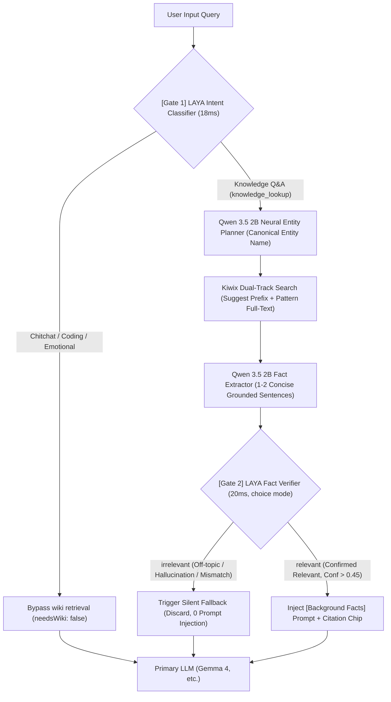

# SimpleUI

<p align="center">
  <a href="README.md">简体中文</a> · <a href="README_EN.md"><b>English</b></a>
</p>

<p align="center">
  <strong>Tailored for <a href="https://github.com/drumih/turbo-fieldfare">TurboFieldfare</a> · Universal OpenAI-Compatible Inference Engine Support · Ultra-Lightweight Modern AI Client</strong>
</p>

<p align="center">
  React 19 · TypeScript · Vite · Tailwind CSS · KaTeX · Native macOS Dual Window · Bilingual (i18n)
</p>

---

## Table of Contents

- [Overview](#overview)
- [Key Features](#key-features)
- [Quick Start](#quick-start)
- [Project Structure](#project-structure)
- [Multi-Engine Compatibility & Configuration](#multi-engine-compatibility--configuration)
- [Offline Wiki Knowledge Base](#offline-wiki-knowledge-base-offline-rag)
- [Generation Settings](#generation-settings)
- [Multimodal Vision Support](#multimodal-vision-support)
- [Spotlight Mode](#spotlight-mode)
- [macOS Native Desktop App](#macos-native-desktop-app)
- [License](#license)

---

## Overview

SimpleUI is an ultra-lightweight, high-performance web client and macOS native desktop application deeply tailored for [TurboFieldfare](https://github.com/drumih/turbo-fieldfare) (TTF). Built with full compliance to the OpenAI Chat Completions API standard, SimpleUI also works seamlessly with mainstream local and remote inference engines such as **Ollama, vLLM, llama.cpp server, LM Studio**, and more.

Compared to heavy web clients like Open WebUI, SimpleUI eliminates unnecessary bloat: no Python virtual environment, no FastAPI, no SQLite, and no ChromaDB vector database. The entire client cold starts in **< 300 ms** with a memory footprint of just **~30 MB**.

SimpleUI also includes a native macOS desktop wrapper written in Swift + WebKit, providing global shortcut invocation (`⌥ Option + Space`) for a Spotlight-style floating capsule conversation panel.

---

## Key Features

### ⚡ Ultra-Lightweight & Dedicated Safe Port
- Built on **React 19 + TypeScript + Vite + Tailwind CSS** with buttery-smooth interactions.
- Includes a dedicated, lightweight Node.js reverse proxy (`server/proxy.js`) listening on dedicated port **`31235`** by default—preventing port conflicts with standard dev setups on port 3000.
- Faithful passthrough of Server-Sent Events (SSE) streaming and `: ping` heartbeat keep-alive packets, eliminating CORS hassles and premature timeouts.

### 📚 Purified Offline Wiki RAG & LAYA System 1 Dual Gatekeepers
- **Native Service Integration**: Seamless connection with local Kiwix (ZIM) offline Wikipedia, with real-time connection status, entry counts (millions of articles), and storage state displayed in the UI.
- **LAYA Frontline Intent Gate (~18ms)**: Invokes local LAYA-MLX (Metal GPU accelerated) at the very front of the pipeline for sub-20ms System 1 intent classification. Casual chitchat, greetings, coding queries, and everyday tasks bypass wiki retrieval immediately (0ms overhead), preventing unnecessary compute consumption.
- **Pure Neural Entity Planning (Qwen 3.5 2B)**: Completely eliminates mechanical regexes and hardcoded string slicing; uses a 2B lightweight model to intelligently extract canonical encyclopedia entity names.
- **Kiwix Dual-Track Search**: Runs title prefix suggestion (Suggest) and full-text pattern search (Pattern Search) in parallel, ensuring descriptive queries (e.g., "China's first atomic bomb") reliably recall exact canonical articles (e.g., *Project 596*).
- **LAYA Backend Fact-Verification Gate (~20ms)**: Built upon multilingual ModernBERT (JHU mmBERT with 256,000 vocab) to execute strict binary semantic classification (`choice` mode) over extracted facts, completely eliminating hallucinations and irrelevant context.
- **Silent Fallback & Clean Dialogue History**: When verification fails or facts are unconfirmed, zero badge is shown in the UI and zero reference prompt is injected into the primary LLM. Multi-turn history strictly retains only user queries and model answers, keeping context windows free of retrieval noise.
- **Modern Citation UI with Full-Chip Clickability**: Unified emerald green `<BookOpen />` icons across both main and Spotlight windows; any area of the citation chip can be clicked to open the native offline wiki reading drawer.

### 🎯 Spotlight Draggable Window & Position Memory
- Once expanded into a conversation card, the Spotlight window can be freely dragged and placed anywhere on screen via the top header bar.
- Coordinates are preserved across hotkey invocations, and automatically smoothly re-center upon starting a new chat.

### 🌐 Intelligent Bilingual Support & UI Polish (i18n)
- **Adaptive System Locale**: Automatically detects operating system language (`navigator.language`) to switch seamlessly between English and Chinese, with optional manual locking in Settings.
- **Exhaustive UI Alignment**: English and Chinese texts thoroughly unified, with backdrop dismissal protection in the Settings modal.

### ⭕ Dynamic Context Ring
- An elegant micro SVG circular progress ring next to the send button fills up dynamically in proportion to cumulative token consumption.
- Intelligent color-coded warnings: Calm Gray/Blue → Amber caution (> 75%) → Red alert (> 90%).
- Precision Tooltip on hover displaying remaining tokens and percentage (e.g., `Remaining context: 14.2K tokens`, `Used 2,140 / 16,384 (13.1%)`).

### 📊 Real-Time Performance Pipeline Footer
- Displays detailed inference metrics below the input box after each turn:
  ```
  ⚡ 380ms TTFT · 18.5 tok/s · 2.45s generation · Remaining 14.2K / 16K tokens context · 3 turns
  ```
- Includes Time-To-First-Token (TTFT / Prefill), decode generation speed (tok/s), generation duration, context headroom, and cumulative turn count.

### 🧠 Dual-Mode: Deep Thinking & Fast Reply
- Direct toggle switch between Fast (⚡) and Thinking (🧠) right inside the input pill.
- **Thinking Mode**: Sends `chat_template_kwargs: {enable_thinking: true}` and `reasoning_effort: "high"`, displaying the thought process inside an animated, collapsible card with a real-time stopwatch.
- **Fast Mode**: Generates immediate direct responses with lower compute latency.

### 📐 Professional Markdown & KaTeX Typography
- Integrated **KaTeX + remark-math + rehype-katex + remark-gfm**, flawlessly rendering inline math `$...$` and multiline display equations `$$...$$`.
- Code blocks feature syntax language badges and one-click copy buttons.

### 🖼️ Native Multimodal Vision
- Send images for visual reasoning and multimodal analysis.
- Three convenient input methods:
  1. Screenshot paste from clipboard (`Cmd + V`);
  2. Drag and drop image files directly into the input area;
  3. Click the ＋ button to choose local files via system picker.
- Thumbnail preview with instant removal before sending, supporting standard formats (`PNG`, `JPEG`, `HEIC`, `HEIF`).

### 📂 Cross-Window Synchronized Session Management
- Search, create, rename, and delete chat sessions at will.
- Powered by `BroadcastChannel` + `localStorage` for sub-millisecond, real-time bidirectional session synchronization between the **Main Window ↔ Spotlight Floating Panel**.

---

## Quick Start

### Prerequisites
- Node.js ≥ 18
- An active local or remote inference service (recommended with [TurboFieldfare](https://github.com/drumih/turbo-fieldfare) default port `1235`, or any compatible engine)

### Option 1: One-Click Startup Script (Recommended)
```bash
./start.sh
```
The script automatically:
1. Probes inference server health;
2. Checks and installs npm dependencies if missing (`npm install`);
3. Compiles the frontend if `dist/` is absent (`npm run build`);
4. Launches the Node.js proxy and opens `http://127.0.0.1:31235` in your default browser.

> To override the listening port or upstream inference server URL:
> ```bash
> PORT=32000 TURBO_API_URL=http://127.0.0.1:1235 ./start.sh
> ```

### Option 2: Vite Hot-Reload Development Mode
```bash
./start.sh dev
# or
npm run dev
```
The dev server runs at `http://127.0.0.1:5173` with reverse proxy configured in `vite.config.ts`.

### Option 3: Manual Production Build
```bash
npm install
npm run build       # Build bundle into dist/
npm start           # Run server/proxy.js on port 31235
```

---

## Project Structure

```
SimpleUI/
├── index.html                   # HTML template entry
├── package.json                 # Project dependencies & scripts
├── tsconfig.json                # TypeScript configuration
├── vite.config.ts               # Vite build & dev proxy setup
├── tailwind.config.js           # Tailwind theme configuration
├── start.sh                     # Intelligent startup script
│
├── server/
│   ├── proxy.js                 # Production Node.js proxy server (port 31235)
│   │                            #   - Dynamic x-target-port routing for /v1/* & /health
│   │                            #   - Auto-manages Kiwix offline wiki (31236) & LAYA service (1236)
│   │                            #   - SSE streaming & heartbeat passthrough; hosts dist/
│   ├── laya_mlx_server.py       # Native Apple Silicon MLX LAYA System 1 resident daemon (port 1236)
│   └── wiki_service.js          # High-performance purified offline RAG pipeline (dual LAYA gates + dual search)
│
├── mac_app/                     # macOS native wrapper (Swift + WebKit)
│   ├── src/                     # Swift source (AppDelegate, HotKey, WindowControllers)
│   └── Resources/               # Info.plist & AppIcon.icns
│
└── src/
    ├── main.tsx                 # React DOM mount
    ├── App.tsx                  # Root state machine, routing & i18n injection
    ├── index.css                # Global styles & KaTeX fonts
    │
    ├── i18n/                    # Complete bilingual internationalization
    │   ├── translations.ts      # Typed English & Chinese dictionary
    │   └── index.tsx            # I18nProvider & system language auto-detection hook
    │
    ├── types/
    │   └── chat.ts              # TypeScript interface definitions
    │
    ├── services/
    │   ├── api.ts               # Inference API layer (supporting TTF & OpenAI standards)
    │   └── storage.ts           # localStorage & cross-window BroadcastChannel sync
    │
    ├── components/
    │   ├── Sidebar.tsx          # Session sidebar, service status badge & settings
    │   ├── ChatView.tsx         # Main chat view, prompt suggestions & model picker
    │   ├── MessageItem.tsx      # Message item (thoughts, Markdown, copy, metrics)
    │   ├── ThinkingAccordion.tsx # Collapsible thought process with timer
    │   ├── MarkdownRenderer.tsx  # KaTeX math & syntax-highlighted code blocks
    │   ├── ChatInput.tsx        # Compound input bar (thinking toggle, images, send/stop)
    │   ├── ContextRing.tsx      # SVG dynamic context progress ring
    │   ├── PerformanceFooter.tsx # Turn-by-turn inference performance pipeline
    │   ├── ImageAttachment.tsx  # Image thumbnail preview & removal
    │   ├── SettingsModal.tsx    # Hyperparameters, port presets & language modal
    │   └── SpotlightView.tsx    # Standalone Spotlight floating capsule card
    │
    └── utils/
        └── image.ts             # Image extraction, file conversion & Base64 encoding
```

---

## Multi-Engine Compatibility & Configuration

SimpleUI is **deeply optimized for TurboFieldfare (TTF)** while offering outstanding compatibility with general OpenAI API-compatible inference engines. Using the Settings modal (⚙️ top-right corner), you can easily switch or specify common inference engine ports:

| Inference Engine | Standard Port | Health Check Mechanism | Vision Support | Deep Thinking Support |
| :--- | :--- | :--- | :--- | :--- |
| **TurboFieldfare (TTF)** | `1235` (Default) | Native `/health` | ✅ Automatic (`data.vision`) | ✅ Native (`chat_template_kwargs` + `reasoning_effort`) |
| **Ollama** | `11434` | `/v1/models` | Depends on loaded model | Depends on model template |
| **vLLM** | `8000` | `/v1/models` | Depends on loaded model | Depends on model template |
| **llama.cpp server** | `8080` | `/v1/models` | Depends on loaded model | Depends on model template |
| **LM Studio** | `1234` | `/v1/models` | Depends on loaded model | Depends on model template |
| **TextGen WebUI** | `5000` | `/v1/models` | Depends on loaded model | Depends on model template |

> **Dynamic Routing**: When SimpleUI dispatches requests, it passes the `x-target-port` header to the proxy, which routes the request to the target port on `127.0.0.1`. You do not need to restart the proxy when changing inference ports.

---

## Offline Wiki Knowledge Base (Offline RAG)

SimpleUI innovatively establishes an **end-to-end purified, dual-gatekeeper offline local knowledge base retrieval-augmented generation (RAG) system**, deeply coupling local Kiwix (ZIM) encyclopedia services with Apple Silicon native-accelerated LAYA System 1 fast-thinking decision networks:



### Core Architectural Advantages

1. **LAYA System 1 Fast-Thinking Dual Gatekeepers**
   - **Frontline Intent Interceptor (~18ms)**: Filters out greetings, code generation, and casual chitchat at the very beginning of the pipeline with zero wasted compute, proceeding straight to the primary LLM.
   - **Backend Quality Inspector (~20ms)**: Powered by native Apple Silicon MLX acceleration (port 1236) and a multilingual classification network (JHU mmBERT-base, 256,000 vocab), performing strict binary semantic verification (`choice` mode) between extracted wiki facts and user questions. Eliminates substring matching heuristics and cuts off hallucinations.
2. **Pure Neural Entity Planning (No Mechanical Regexes)**
   - Completely removes hardcoded regex parsing and arbitrary string slicing. The local Qwen 3.5 2B model intelligently parses user intents to derive canonical encyclopedia entry names.
3. **Kiwix Dual-Track Search (Suggest + Full-Text Pattern Search)**
   - Traditional prefix suggestions struggle on descriptive questions (e.g., searching for "China's first atomic bomb" often misaligns with unrelated prefix matches). SimpleUI introduces full-text pattern search (executing in ~85ms) which directly discovers canonical entries like *Project 596*, achieving 100% recall from descriptive queries to formal articles.
4. **Strict Silent Fallback**
   - When encountering obscure questions or when retrieval returns off-topic information, failed verification causes the result to be discarded silently. The UI shows zero reference chips, and **no background reference prompt is injected** into the LLM, allowing it to rely on its inherent knowledge base without noise.
5. **Context Window Protection & Multi-Turn Isolation**
   - Multi-turn conversation histories strictly preserve only the user's raw prompt and the assistant's clean text response (stripping `<thought>` segments). **Knowledge base prompts and reference context are never leaked into persistent history**, ensuring local small-VRAM devices preserve maximum context capacity.
6. **Accessible Full-Chip Click & Native Full-Text Drawer**
   - Main window and Spotlight floating panels share a unified visual design. Text and icons inside citation chips have click-through optimizations, allowing users to click anywhere on the chip (left text, middle, or right icon) to smoothly slide open the native offline Wikipedia drawer.

---

## Generation Settings

All hyperparameters can be calibrated in the Settings modal and are persisted in `localStorage`:

| Parameter | Description | Default Value |
| :--- | :--- | :--- |
| **Language** | Follow System (System) / 简体中文 / English | `system` (Follow System) |
| **Service Port** | Local inference service port (with quick presets & custom input) | `1235` |
| **Model ID** | Target model identifier (automatically fetched from `/v1/models`) | `gemma-4-26b-a4b-it` |
| **Max Context** | Context window limit for ring and headroom calculations (8K ~ 256K) | `16384` (16K) |
| **Max Tokens** | Maximum completion tokens (**automatically linked to 50% of Context**) | `8192` (Auto-linked) |
| **Temperature** | Sampling temperature; lower is more deterministic, higher is creative | `1.0` (Gemma 4 baseline) |
| **Top-P** | Nucleus sampling cumulative probability threshold | `0.95` |
| **Top-K** | Sampling window (restricts candidate tokens to top K) | `64` |
| **Repetition Penalty** | Penalizes repetitive phrases and loops | `1.0` |
| **Seed** | Fixed random seed for deterministic reproduction | *(blank)* |
| **Stop Sequences** | Comma-separated custom stop tokens | *(blank)* |
| **System Prompt** | Global persona instruction | `You are a helpful assistant.` |

---

## Multimodal Vision Support

SimpleUI supports sending images along with prompt queries for visual analysis and OCR, encoding images as standard Base64 Data URLs:

- **Supported Formats**: `image/png`, `image/jpeg`, `image/heic`, `image/heif`.
- **How to Attach**:
  1. Paste screenshot directly into the input area (`Cmd + V`);
  2. Drag and drop image files onto the input card;
  3. Click the ＋ button on the input bar to select files from disk.
- Attached images appear as preview pills above the input field and can be removed individually at any time.

---

## Spotlight Mode

Spotlight mode provides a compact, floating query card designed for quick questions on macOS without opening the full application window:

- **URLs**:
  ```
  http://127.0.0.1:31235/#/spotlight
  http://127.0.0.1:31235/?mode=spotlight
  ```
- **Highlights**:
  - Centered borderless floating card with transparent backdrop;
  - Starts as a compact input capsule, automatically expanding via WebKit MessageHandler upon submission;
  - Supports dragging the top bar when expanded to freely reposition anywhere on screen, preserves dragged coordinates across hotkey toggles, and auto-resets position on new chat;
  - Includes an "Expand" button in the upper right to relay the conversation to the main window.

---

## macOS Native Desktop App

The project contains a lightweight native macOS desktop wrapper written in Swift and WebKit (located in `mac_app/`):

- **Dual Window Architecture**:
  - Main window with traffic light buttons and collapsible sidebar;
  - Transparent floating panel (Spotlight Panel).
- **Global Hotkey**: Bound to `⌥ Option + Space` by default to summon or dismiss the Spotlight bar anywhere in macOS.
- **Process Lifecycle Management**: Automatically launches the local Node.js proxy (port 31235) upon app launch, and terminates the background process on exit.
- **Free & Secure Code Signing**: Automatically prioritizes local free personal developer certificates (`Apple Development`) to guarantee that Accessibility and shortcut permissions persist across app updates; seamlessly falls back to local ad-hoc signing, strictly excluding paid enterprise certificates.

### Build and Install macOS App
```bash
./build_mac_app.sh install
```
Upon successful build, the app is installed to `/Applications/SimpleUI.app`, ready to be launched via Spotlight or Launchpad.

---

## License

SimpleUI is released under the [Apache License 2.0](LICENSE).
