# SimpleUI

<p align="center">
  <a href="README.md">简体中文</a> · <a href="README_EN.md"><b>English</b></a>
</p>

<p align="center">
  <strong>A modern, lightweight AI client deeply customized for <a href="https://github.com/drumih/turbo-fieldfare">TurboFieldfare</a> with broad compatibility for standard inference engines</strong>
</p>

<p align="center">
  React 19 · TypeScript · Vite · Tailwind CSS · KaTeX · Native macOS Dual-Window · Bilingual
</p>

---

## Table of Contents

- [Overview](#overview)
- [System Architecture](#system-architecture)
- [Offline Wiki RAG Pipeline](#offline-wiki-rag-pipeline)
- [Context Window Management](#context-window-management)
- [Inference Engine Compatibility](#inference-engine-compatibility)
- [Quick Start](#quick-start)
- [Project Structure](#project-structure)
- [License](#license)

---

## Overview

SimpleUI is a high-performance, ultra-lightweight frontend client and native macOS desktop application purpose-built for [TurboFieldfare](https://github.com/drumih/turbo-fieldfare) (TTF). Through full OpenAI API compatibility, it also connects seamlessly to **Ollama, vLLM, llama.cpp server, LM Studio**, and other popular local/remote inference engines.

Compared to heavyweight solutions like Open WebUI, SimpleUI eliminates all unnecessary dependencies (no Python virtualenv, FastAPI, SQLite, or vector databases). The frontend bundle is minimal, cold start takes **< 300 ms**, and memory usage is approximately **30 MB**.

The two core technical highlights:

1. **End-to-end Offline Wiki RAG Pipeline**: Zero-truncation, **generation-free retrieval** (raw article text injected directly, no small-model fact rewriting), with a single model handling all semantic decisions — running entirely on Apple Silicon, no cloud calls.
2. **Two-Phase Dynamic Context Tracking**: Precisely distinguishes peak context usage during generation from clean persistent baseline after completion, reflected in real time on screen.

---

## System Architecture

```
User Input (React Frontend)
     │
     ▼
Node.js Proxy Server (port 31235)
     │
     ├──► Wiki RAG Service (wiki_service.js)
     │         │
     │         ├──► Kiwix Offline Wiki (port 31236 · ZIM file)
     │         └──► Primary Model (port 1235) ← entity planning / long-article section routing
     │
     └──► Primary Inference Model (port 1235 · TTF / Ollama / vLLM etc.) ← final answer generation
```

| Service | Port | Role |
| :--- | :--- | :--- |
| Node.js Proxy (`proxy.js`) | `31235` | SSE passthrough, static hosting, dynamic routing, knowledge-base API |
| Kiwix Offline Encyclopedia | `31236` | ZIM file serving, title suggestions, article HTTP |
| Primary Inference Model | `1235` | Entity planning, long-article section routing, final answer generation |

> Two auxiliary services from the earlier architecture have been removed:
> **LAYA System 1** (port 1236) intent gate — misclassified roughly 1/3 of knowledge questions as chitchat, blocking the entire pipeline;
> **Qwen 3.5 2B** (port 1234) small model — previously handled entity planning, candidate re-ranking, and fact rewriting (MRC),
> now replaced by primary-model planning, a deterministic article-selection rule, and direct raw-text injection.
> The pipeline now depends on only two services: Kiwix and the primary model.

### Cross-Window Synchronization

The Main Window and Spotlight floating panel sync bi-directionally in real time via `BroadcastChannel` (`syncChannel`):

| Message Type | Triggered When | Payload |
| :--- | :--- | :--- |
| `STREAM_TOKEN_PROGRESS` | During streaming (every 20 tokens) | `{ sessionId, liveTokens }` |
| `STREAM_CHUNK` | Every SSE delta | Incremental text |
| `STREAM_DONE` | Generation complete | Final metrics, cleanHistoryTokens |
| `STREAM_ABORT` | User stops generation | sessionId |
| `SESSIONS_CHANGED` | Sessions added/renamed/deleted | - |
| `SETTINGS_CHANGED` | Settings updated | New config |

---

## Offline Wiki RAG Pipeline

SimpleUI builds an **end-to-end, zero-truncation, generation-free** offline local knowledge retrieval-augmented generation system, running entirely on Apple Silicon — no cloud dependencies.

Core idea: **no model in the retrieval chain ever "generates" a search key or "rewrites" article text**. Article names are not invented by a model (the raw query is searched directly), and what gets injected is not a model-written summary (the normalized raw article text is injected directly) — no rewriting, no fabrication.

### Complete Pipeline

```mermaid
flowchart TD
    Q["User Input Query"] --> NORM["0ms Global Normalization: toSimplifiedChinese\n(Traditional→Simplified, HK/TW vocab→Mainland standard)"]
    NORM --> PLAN["Primary-model entity planning\nExtract 1~2 canonical article names\n(system role · no thinking · temperature 0)\nOn failure: search the normalized raw query directly"]

    PLAN --> VARIANTS["OpenCC Variant Matrix Expansion\nSimplified → Standard Traditional / TW / TW-phrases / HK\n(getAllVariants)"]
    VARIANTS --> SEARCH["Kiwix two-track parallel search (all variants)\n① Exact Probe HEAD /content (200/302)\n② Title Suggest /suggest (count=30)"]
    SEARCH --> FILTER["Title filtering + deep redirect deduplication\nKeep only article pages that exactly match or contain a keyword\nNamespace pages (Category/Portal/Template…) always dropped"]
    FILTER --> SELECT["Per-keyword article selection (deterministic, no model)\nExact match → take exactly one\nNo exact match → containment matches, up to two by title length ascending\n(cross-keyword dedup · strictly serial)"]
    SELECT --> DOM["Kiwix HTTP Full HTML Fetch\nparseWikipediaDOM:\n  - Paired deep removal of navboxes/banners/references\n  - Infobox extracted as a whole via tag pairing (no length cap)\n  - Full lead + body paragraphs + lists(·) + tables(|)"]
    DOM --> NORM2["Second global normalization: toSimplifiedChinese\n(Infobox keys/values, lead, section titles, paragraphs)"]
    NORM2 --> BRANCH{"Cleaned text length > 3500 chars?"}
    BRANCH -->|"≤ 3500"| PANO["Panoramic mode\nInfobox + full lead + all sections"]
    BRANCH -->|"> 3500"| ROUTE["Primary-model section router\nSelect 1~2 most relevant sections + 1~3 infobox keys\n(full lead always kept, nothing truncated)"]
    PANO --> CTX["Normalized raw context\n(no rewriting · no summarizing · no mechanical truncation)"]
    ROUTE --> CTX
    CTX --> BUDGET["Load within remaining-context budget\nOver-budget articles dropped whole\nIf none fit → prompt user to start a new conversation"]
    BUDGET --> INJECT["Inject Grounding Prompt\n【Title】 + raw text (Infobox/lead/lists/tables)\n+ citation chips (title only, click to view original)"]
    BUDGET -->|"0 citations"| SILENT["Silent fallback\nnothing injected"]

    INJECT --> LLM["Primary LLM generates the final answer\nLocates relevant info itself; lists may be reproduced verbatim"]
    SILENT --> LLM
```



### Step-by-Step Technical Notes

#### Step 0: Global Normalization (OpenCC)

`toSimplifiedChinese(text)` uses **opencc-js** in a two-stage cascade:
1. `cn → t`: Aligns Mainland Simplified transcriptions of HK/TW vocabulary (e.g. "记忆体", "软体") into the Traditional dictionary index ("記憶體", "軟體")
2. `twp → cn` + `hk → cn`: Converts regional Traditional forms and idioms back to Mainland Simplified ("内存", "软件")

Applied to the user query, Infobox keys/values, section titles, and body paragraphs for full end-to-end vocabulary alignment. All Chinese script/variant conversion is **handled exclusively by OpenCC** — no hand-written mapping tables.

#### Step 1: Primary-Model Entity Planning

- **Model**: the primary inference model (default Gemma 4 26B-A4B, port 1235)
- **Call convention**: rules in `system`, examples + question in `user` (Gemma 4 natively supports the system role); thinking disabled; `temperature=0` (measured identical quality to the officially recommended 1.0 across 12 fresh questions, but 1.0 causes plan variance)
- **Task**: extract 1~2 canonical encyclopedia entry names from the full natural language query, output pure JSON `{"target_articles": [...]}`
- **Anti-hallucination**: the prompt explicitly requires "default to exactly 1; give 2 only when the question genuinely involves two independent entities; never invent entities"
- **No fallback**: no small-model bailout; on planning failure the normalized raw query is searched directly
- **Performance**: primary-model prefill ≈ 30ms/token, ~9s per planning call; prompt length is the only effective lever (no effective prefix caching)

#### Step 2: OpenCC Variant Matrix Expansion

`getAllVariants(term)` expands each planned entity into all script variants:

| Variant | Example ("鼠标" / mouse) | Example ("周杰伦" / Jay Chou) |
| :--- | :--- | :--- |
| Mainland Simplified (original) | 鼠标 | 周杰伦 |
| Standard Traditional `cn→t` | 鼠標 | 周杰倫 |
| Taiwan Traditional `cn→tw` | 滑鼠標 | 周杰倫 |
| Taiwan Traditional + phrases `cn→twp` | 滑鼠 | 周杰倫 |
| Hong Kong Traditional `cn→hk` | 滑鼠 | 周杰倫 |

**All variants** enter a deduplicated Set for subsequent retrieval (the old version only used the first 2~4, causing missed hits), ensuring hits regardless of which script form the ZIM index uses.

#### Step 3: Kiwix Title Search + Filtering + Deep Redirect Deduplication

Only the **title track** is used (no full-text search):

| Track | Endpoint | Purpose |
| :--- | :--- | :--- |
| **Exact Probe** | `HEAD /content/{id}/{variant}` | Detects exact article existence or 302 redirects (kept on hit) |
| **Title Suggest** | `/suggest?content=...&term=...&count=30` | Title index, covers exact and extended titles |

Then three convergence steps:
1. **Title filtering**: keep only article pages whose title **exactly equals** or **fully contains** a keyword variant; `Category:`, `Portal:`, `Template:` and other namespace pages are always dropped
2. **Deep redirects**: each candidate gets a `HEAD` (`redirect:manual`) to resolve Kiwix's canonical path — preventing multiple aliases of the same article (e.g. 「康托」→「格奥尔格·康托尔」) from being counted as separate articles
3. **Deduplicate by canonical path**, keeping at most 6

#### Step 4: Per-Keyword Article Selection (Deterministic Rule, No Model)

Each keyword independently selects articles, with a fully deterministic rule:

| Situation | Behavior |
| :--- | :--- |
| An "exact match" article exists | **Take exactly one** (try in order, take the first whose body is successfully fetched) |
| No exact match | Containment matches sorted by **title length ascending** (fewest extra characters first), **up to two** |
| Not even a containment match | This keyword contributes nothing; other keywords are unaffected |

- Deduplication already happened during search (by canonical path); only cross-keyword deduplication happens here
- Exact match = exact-probe hit, or a title identical to a keyword variant
- Two keywords → at most two articles; all processed strictly serially (the primary model does not support concurrency)

#### Step 5: Full HTML Fetch & DOM Parsing

`parseWikipediaDOM(html)` pipeline:

1. **Tail cutoff**: Truncates from "Notes"/"References"/"External Links"/"See also"/"Further reading" sections onward (handles both h2 and h3 headings)
2. **Paired deep removal** (`removeElementsByClass`): navboxes, sidebars, maintenance banners (ambox), reference wrappers — multi-layer nested structures must be removed by matching `<tag>`/`</tag>` pairs; non-greedy regex stops at the first closing tag and leaks inner `<li>`/`<td>` into the body text
3. **Invisible content removal**: MediaWiki sort keys (`sortkey`, e.g. `7008299792458000000♠`), `display:none` elements, `[citation needed]`-style markers — browsers never render these, but plain-text extraction picks them up
4. **Infobox extracted as a whole via tag pairing**: Infoboxes commonly nest sub-tables; likewise matched by `<table>`/`</table>` pairs, all `<th>/<td>` rows collected with **no length cap**
5. **Structure split**: First `<h2>` boundary separates the full Lead (section0) from sections
6. **In-order content block extraction**: `<p>` paragraphs, `<ul>/<ol>` lists (converted to "· item" lines), `<table>` tables (converted to "| cell | cell |" pipe tables) — original order preserved, **no length filtering**

> **Zero-truncation principle**: Content is never character-truncated. Cleaning only targets "elements browsers don't render" and "non-article pages"; article text is always kept.

#### Step 6: Second Global Normalization

All Infobox keys, values, section titles, lead paragraphs, and body paragraphs are passed through `toSimplifiedChinese` again, eliminating script and vocabulary bias from ZIM files stored in Traditional Chinese. Measured: the Traditional article 《周杰倫》 produces zero Traditional-script residue.

#### Step 7: Long-Article Routing

- **Standard articles (≤ 3500 chars, ~75%)**: `panoramic` mode — full Infobox + full lead + all sections
- **Extra-long articles (> 3500 chars)**: `routed` mode — the **primary model** selects 1~2 most relevant sections and 1~3 infobox keys from the heading outline; the **complete paragraphs** of those sections are included in full, and the **full lead is always kept** — nothing truncated

#### Step 8: Direct Raw-Text Injection (No MRC)

The earlier architecture had a "Machine Reading Comprehension" step here: a small model read the article and compressed it into one factual sentence. In practice it **fabricated** (producing "Goldbach's conjecture was proposed by Georg Cantor" from the Cantor-set article). That step has been removed entirely.

Now the normalized raw text produced by `assembleArticleContext` is **injected directly** into the primary model, which locates the relevant information itself and combines it with its own knowledge:
- No rewriting means no fabrication
- Enumeration questions ("list all works") can reproduce the original lists verbatim
- Clicking a citation chip shows this plain text above the original wiki page in the drawer — **verifiable**

#### Step 9: Context-Budget Loading

The frontend estimates available tokens as `maxContext - maxTokens` (Chinese ≈ 1 token/char, ×1.5 to chars) and passes `budgetChars` to the backend. Articles are loaded in retrieval-priority order; **over-budget articles are dropped whole, never truncated mid-text**. This is an adaptive resource constraint — the larger the configured context, the larger the budget and the less often it triggers. If not even one article fits (conversation grown too long), the backend returns a `contextOverflow` signal and the frontend prompts the user to start a new conversation.

#### Injection Prompt

```
[Encyclopedia Context]
Below are one or more encyclopedia articles (Infobox, lead section and relevant
body sections) retrieved from an offline knowledge base for the user's question.

【Article Title】
<raw text>

[How to answer]
1. [Relevance filtering]: Locate the parts of the context that actually answer
   the question and ignore the rest.
2. [Fact grounding]: Treat the facts, dates, people and numbers found there as
   your factual anchor. Combine them with your own knowledge when partial.
3. [Reproduce when asked]: If the user asks you to enumerate or list something,
   reproduce the corresponding list from the context faithfully.
4. [Cite]: Mention which encyclopedia article(s) you used.

[User Question]
<original question>
```

The Grounding Prompt is an ephemeral wrapper, **never written to persistent conversation history**.

### Core Design Principles

1. **Generation-free retrieval**: Neither search keys nor injected content is model-generated — the raw query is searched directly and raw text is injected directly. No rewriting means no fabrication.
2. **Zero-truncation**: Article text is passed intact; the only trade-off is "load a whole article or drop it whole" (context budget), never mid-text truncation.
3. **Zero-contamination**: The Grounding Prompt is ephemeral — never written to persistent conversation history.
4. **Zero mechanical rules**: No keyword regex stripping, no hardcoded greeting bypass, no regex-based fact-relevance filtering; all Chinese script conversion is delegated to OpenCC.
5. **Abstention first**: Any step that yields nothing silently exits; the primary LLM falls back to general knowledge without noise injection. A missed citation costs far less than a wrong one.
6. **Paired scanning**: All structural HTML removal (navboxes, Infobox, references) uses matched-tag depth scanning — non-greedy regex is never used on nested structures.
7. **Single model, strictly serial**: Only the primary model makes semantic decisions (planning/routing/generation), and it is called strictly serially — it does not support concurrent requests; there is no in-memory result cache.

---

## Context Window Management

### Two-Phase Dynamic Tracking (Surge / Recede)

```
During generation (Phase 1 — Surge):
  liveStreamingTokens = initialPromptTokens + generated tokens so far
  ← Refreshed every 20 tokens, synchronized across both windows via BroadcastChannel

After generation (Phase 2 — Recede):
  liveStreamingTokens = null
  displayTokens = persistentHistoryTokens (computed via useMemo)
  ← Only counts durable history (user messages + final assistant answers), naturally lower
```

**Why two phases are necessary:**

During generation, context includes: persistent history + RAG Grounding Prompt (~1,500 tokens) + reasoning model `reasoningContent` (up to ~3,000 tokens). After generation, the next turn's `wireMessages` only sends `msg.content` — no `reasoningContent`, no RAG prompt. The actual token count drops significantly.

The old approach stored `metrics.totalTokens` (~5,000) into `session.contextUsed`, leaving the ring stuck at peak even when the next turn would only use ~300 tokens. The fix: `onDone` calls `estimateHistoryTokens` to compute clean persistent history tokens and stores that as `contextUsed`. The ring naturally recedes after each generation.

### Token Estimator (`src/utils/token.ts`)

```typescript
// CJK characters: ~0.75 tokens/char (tuned for Qwen/Gemma tokenizers)
// Non-CJK characters: ~1 token / 3.8 chars
// Per-message chat template overhead: +4 tokens
// Image (vision): +576 tokens/image (standard vision budget)
// System prompt included in baseline

estimateTextTokens(text: string): number
estimateHistoryTokens(messages: Array<Partial<ChatMessage>>, systemPrompt?: string): number
```

`estimateHistoryTokens` **only counts**: user `content`, assistant `content` (final answer), image attachments.  
**Explicitly excludes**: `reasoningContent` (chain-of-thought), ephemeral RAG Grounding Prompt.

### Context Ring Display Rules

| Window | During Generation | After Generation |
|---|---|---|
| **Main Window (large)** | `liveStreamingTokens` drives ring + remaining % text shown to the right | `persistentHistoryTokens` drives ring + remaining % |
| **Spotlight (small)** | `liveStreamingTokens` drives ring — circle only | `persistentHistoryTokens` drives ring — circle only |

Remaining percentage format: `≥ 99.95%` displays as `100%`, otherwise `X.X%` (e.g. `98.6%`).

---

## Inference Engine Compatibility

SimpleUI is most deeply optimized for TurboFieldfare (TTF) while fully supporting the standard OpenAI API:

| Service | Port | Deep Thinking | Vision |
| :--- | :--- | :--- | :--- |
| **TurboFieldfare (TTF)** | `1235` | ✅ Native (`chat_template_kwargs` + `reasoning_effort`) | ✅ Auto-detected |
| **Ollama** | `11434` | Depends on model template | Depends on model |
| **vLLM** | `8000` | Depends on model template | Depends on model |
| **llama.cpp server** | `8080` | Depends on model template | Depends on model |
| **LM Studio** | `1234` | Depends on model template | Depends on model |

> **Routing mechanism**: The `x-target-port` request header tells the Node.js proxy which port to forward to. Switching inference engines requires no proxy restart.

---

## Quick Start

### Prerequisites
- Node.js ≥ 18
- A running local or LAN inference service (recommended: [TurboFieldfare](https://github.com/drumih/turbo-fieldfare) on default port `1235`)

### Option 1: One-Command Start (Recommended)
```bash
./start.sh
```
Auto-detects inference service, installs dependencies (first run), builds, starts proxy, and opens `http://127.0.0.1:31235`.

### Option 2: Dev Mode with Hot Reload
```bash
./start.sh dev
# or
npm run dev
```

### Option 3: Build macOS Desktop App
```bash
./build_mac_app.sh install
```
Compiles and installs to `/Applications/SimpleUI.app`. Supports global hotkey `⌥ Option + Space` to summon the Spotlight floating panel.

---

## Project Structure

```
SimpleUI/
├── server/
│   ├── proxy.js              # Node.js proxy server (port 31235)
│   │                         #   SSE passthrough, static hosting, dynamic port routing
│   ├── wiki_service.js       # Offline RAG pipeline core
│   │                         #   Primary-model planning & section routing, Kiwix title search
│   │                         #   with redirect deduplication, parseWikipediaDOM (paired
│   │                         #   deep cleaning / lists / tables), assembleArticleContext
│   │                         #   toSimplifiedChinese, getAllVariants (OpenCC)
│   └── laya_mlx_server.py    # LAYA System 1 service (removed from the pipeline, file kept for reference)
│
├── mac_app/                  # macOS native dual-window wrapper (Swift + WebKit)
│   ├── src/                  # AppDelegate, HotKey, WindowControllers
│   └── Resources/            # Info.plist, AppIcon.icns
│
└── src/
    ├── App.tsx               # Top-level state machine, session management, liveStreamingTokens
    ├── services/
    │   ├── api.ts            # Inference engine communication, SSE parsing, onTokenProgress
    │   └── storage.ts        # localStorage persistence, BroadcastChannel
    ├── utils/
    │   └── token.ts          # Offline token estimator (CJK + non-CJK + images)
    └── components/
        ├── ContextRing.tsx   # SVG dynamic context ring (showRemainingPercent option)
        ├── ChatInput.tsx     # Composite input (thinking toggle, images, send/stop)
        ├── SpotlightView.tsx # Spotlight panel complete state machine
        ├── ChatView.tsx      # Main conversation view
        ├── MessageItem.tsx   # Single message (thinking accordion, Markdown, KaTeX)
        └── SettingsModal.tsx # Parameter config, inference port, language settings
```

---

## License

SimpleUI is released under the [Apache License 2.0](LICENSE).
