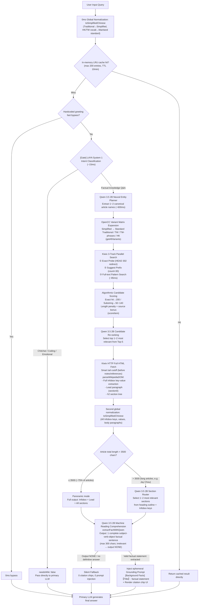

# SimpleUI

<p align="center">
  <a href="README.md">简体中文</a> · <a href="README_EN.md"><b>English</b></a>
</p>

<p align="center">
  <strong>A modern, lightweight AI client deeply customized for <a href="https://github.com/drumih/turbo-fieldfare">TurboFieldfare</a> with broad compatibility for standard inference engines</strong>
</p>

<p align="center">
  React 19 · TypeScript · Vite · Tailwind CSS · KaTeX · Native macOS Dual-Window · Bilingual
</p>

---

## Table of Contents

- [Overview](#overview)
- [System Architecture](#system-architecture)
- [Offline Wiki RAG Pipeline](#offline-wiki-rag-pipeline)
- [Context Window Management](#context-window-management)
- [Inference Engine Compatibility](#inference-engine-compatibility)
- [Quick Start](#quick-start)
- [Project Structure](#project-structure)
- [License](#license)

---

## Overview

SimpleUI is a high-performance, ultra-lightweight frontend client and native macOS desktop application purpose-built for [TurboFieldfare](https://github.com/drumih/turbo-fieldfare) (TTF). Through full OpenAI API compatibility, it also connects seamlessly to **Ollama, vLLM, llama.cpp server, LM Studio**, and other popular local/remote inference engines.

Compared to heavyweight solutions like Open WebUI, SimpleUI eliminates all unnecessary dependencies (no Python virtualenv, FastAPI, SQLite, or vector databases). The frontend bundle is minimal, cold start takes **< 300 ms**, and memory usage is approximately **30 MB**.

The two core technical highlights:

1. **End-to-end Offline Wiki RAG Pipeline**: Zero-truncation, dual-gatekeeper, fully-neural local knowledge retrieval running entirely on Apple Silicon — no cloud calls.
2. **Two-Phase Dynamic Context Tracking**: Precisely distinguishes peak context usage during generation from clean persistent baseline after completion, reflected in real time on screen.

---

## System Architecture

```
User Input (React Frontend)
     │
     ▼
Node.js Proxy Server (port 31235)
     │
     ├──► Wiki RAG Service (wiki_service.js)
     │         │
     │         ├──► LAYA System 1 (port 1236 · Apple Silicon MLX)
     │         ├──► Qwen 3.5 2B SLM (port 1234 · LM Studio)
     │         └──► Kiwix Offline Wiki (port 31236 · ZIM file)
     │
     └──► Primary Inference Model (port 1235/1236 · TTF / Ollama / vLLM etc.)
```

| Service | Port | Role |
| :--- | :--- | :--- |
| Node.js Proxy (`proxy.js`) | `31235` | SSE passthrough, static hosting, dynamic routing |
| Kiwix Offline Encyclopedia | `31236` | ZIM file serving, full-text search, article HTTP |
| Qwen 3.5 2B SLM | `1234` | Entity planning, intent routing, fact extraction, candidate re-ranking |
| LAYA System 1 | `1236` | Fast intent classification (~15ms) |
| Primary Inference Model | `1235` | Final answer generation (TTF / standard OpenAI interface) |

### Cross-Window Synchronization

The Main Window and Spotlight floating panel sync bi-directionally in real time via `BroadcastChannel` (`syncChannel`):

| Message Type | Triggered When | Payload |
| :--- | :--- | :--- |
| `STREAM_TOKEN_PROGRESS` | During streaming (every 20 tokens) | `{ sessionId, liveTokens }` |
| `STREAM_CHUNK` | Every SSE delta | Incremental text |
| `STREAM_DONE` | Generation complete | Final metrics, cleanHistoryTokens |
| `STREAM_ABORT` | User stops generation | sessionId |
| `SESSIONS_CHANGED` | Sessions added/renamed/deleted | - |
| `SETTINGS_CHANGED` | Settings updated | New config |

---

## Offline Wiki RAG Pipeline

SimpleUI builds an **end-to-end, zero-truncation, fully-neural** offline local knowledge retrieval-augmented generation system, running entirely on Apple Silicon — no cloud dependencies.

### Complete Pipeline



### Step-by-Step Technical Notes

#### Step 0: Global Normalization (Algorithm)

`toSimplifiedChinese(text)` uses **opencc-js** in a two-stage cascade:
1. `cn → t`: Aligns Mainland Simplified transcriptions of HK/TW vocabulary (e.g. "记忆体", "软体") into the Traditional dictionary index ("記憶體", "軟體")
2. `twp → cn` + `hk → cn`: Converts regional Traditional forms and idioms back to Mainland Simplified ("内存", "软件")

Applied to user input, Infobox key-values, and body paragraphs for full end-to-end vocabulary alignment.

#### Step 1: LAYA Intent Classification Gate (LAYA System 1 · Discriminative Model)

- **Model**: JHU mmBERT-base (multilingual ModernBERT, 256,000 vocab), running on local Apple Silicon MLX
- **Latency**: ~15 ms (native Metal GPU acceleration)
- **Decision**: `choice` binary classification: `chitchat_or_code` (bypass) vs `knowledge_lookup` (enter RAG)
- **Purpose**: Filters chitchat, code generation, and emotional interaction at the pipeline front with zero compute waste

#### Step 2: Qwen 3.5 2B Neural Entity Planner (Small Model)

- **Model**: Qwen 3.5 2B (INT4 quantized), running on LM Studio (port 1234)
- **Latency**: ~600 ms
- **Task**: Understands the full natural language query semantically and extracts canonical encyclopedia entry names (1~2), outputs pure JSON `{"target_articles": [...]}`
- **Design**: Entirely semantic — no regex stripping or hardcoded slicing; graceful degradation falls back to the normalized raw query

#### Step 3: OpenCC Variant Matrix Expansion (Algorithm)

`getAllVariants(term)` expands each planned entity into up to 5 variants:

| Variant | Example ("鼠标" / mouse) | Example ("周杰伦" / Jay Chou) |
| :--- | :--- | :--- |
| Mainland Simplified (original) | 鼠标 | 周杰伦 |
| Standard Traditional `cn→t` | 鼠標 | 周杰倫 |
| Taiwan Traditional `cn→tw` | 滑鼠標 | 周杰倫 |
| Taiwan Traditional + phrases `cn→twp` | 滑鼠 | 周杰倫 |
| Hong Kong Traditional `cn→hk` | 滑鼠 | 周杰倫 |

All variants enter a deduplicated Set for subsequent retrieval, ensuring hits regardless of which script form the ZIM index uses.

#### Step 4: Kiwix 3-Track Parallel Search (Algorithm)

Three concurrent tracks with deduplicated merged results:

| Track | Endpoint | Purpose |
| :--- | :--- | :--- |
| **Exact Probe** | `HEAD /content/{id}/{variant}` | Detects exact article existence or 302 redirects |
| **Suggest Prefix** | `/suggest?term=...&count=30` | Title prefix index, covers exact and extended titles |
| **Pattern Full-text** | `/search?pattern=...` | Full-text match, ~85ms, covers descriptive queries (e.g. "China's first atomic bomb" → *Project 596*) |

**Candidate scoring** (algorithmic, `scoreItem`):
- Exact probe hit: +300
- Exact title match: +200 / case-insensitive: +180
- Query is hypernym of title ("日本首都" ⊃ "日本"): +140
- Title starts with query (complete prefix): +110
- Query contains title / title contains query: +50~80
- Title ends with query ("Amazon日本"): +35
- Length penalty, source bonus (suggest rank 0: +30, rank 1: +20)

#### Step 5: Qwen 3.5 2B Candidate Re-ranking (Small Model)

From the Top-5 candidates, presents the full user query + candidate titles to Qwen 3.5 2B, which outputs the most relevant 1~2 titles as a JSON array, establishing the final fetch order.

#### Step 6: Full HTML Fetch & DOM Parsing (Algorithm)

`parseWikipediaDOM(html)` pipeline:
1. **Tail cutoff**: Truncates from "Notes"/"References"/"External Links" sections onward
2. **Noise removal**: Strips `<style>`, `<script>`, `<sup class="reference">`, navboxes, figure/thumbnails
3. **Full Infobox extraction**: Extracts all `<th>/<td>` row pairs; key < 30 chars, value < 150 chars — **no row count cap**
4. **Structure split**: First `<h2>` boundary separates Lead (section0) from sections
5. **Paragraph extraction**: All `<p>` elements with cleaned text length ≥ 20 chars

> **Zero-truncation principle**: Paragraphs are never character-truncated. Filtering is handled semantically by the SLM downstream.

#### Step 7: Second Global Normalization (Algorithm)

All Infobox keys, values, Lead paragraphs, and section paragraphs are passed through `toSimplifiedChinese` again, eliminating vocabulary bias from ZIM files stored in Traditional Chinese.

#### Step 8: Long-Article Routing (Algorithm + Small Model Branch)

- **Standard articles (≤ 3500 chars, ~75%)**: `panoramic` mode — full Infobox + Lead + all sections passed to SLM
- **Extra-long articles (> 3500 chars, e.g. "Jay Chou", "China")**: `routed` mode — Qwen 3.5 2B selects 1~2 most relevant sections from the heading outline + Infobox keys (max 50 tokens), then only those paragraphs are sent to SLM

#### Step 9: Qwen 3.5 2B Machine Reading Comprehension (Small Model)

`extractFactWithQwen(query, articleTitle, context)` targeted fact extraction:
- Instruction: if body text contains the exact answer to the question, output one complete subject-verb-object sentence (≤ 300 chars); otherwise **output only `NONE`**
- Strictly forbidden from extracting unrelated biographical background
- Output `NONE` / function returns `null` → article discarded, silent fallback triggered
- Valid factual statement extracted → builds `[Background Facts]` ephemeral Grounding Prompt, injected into this request only (**never stored in persistent history**)

**The Qwen MRC `NONE` output mechanism is the final filter layer of the entire pipeline** — there is no separate downstream gatekeeper step.

### Core Design Principles

1. **Zero-truncation**: All article text is passed intact; filtering is semantic, not character-based
2. **Zero-contamination**: Grounding Prompt is ephemeral — never written to persistent conversation history
3. **Zero-regex entity extraction**: Entity planning is entirely semantic; no keyword stripping or hardcoded heuristics
4. **Neural gating**: LAYA System 1 (~15ms) intercepts irrelevant requests up front; Qwen MRC acts as the final fact filter via `NONE` output
5. **Silent fallback**: Any failed step silently exits; the primary LLM falls back to general knowledge without noise injection

---

## Context Window Management

### Two-Phase Dynamic Tracking (Surge / Recede)

```
During generation (Phase 1 — Surge):
  liveStreamingTokens = initialPromptTokens + generated tokens so far
  ← Refreshed every 20 tokens, synchronized across both windows via BroadcastChannel

After generation (Phase 2 — Recede):
  liveStreamingTokens = null
  displayTokens = persistentHistoryTokens (computed via useMemo)
  ← Only counts durable history (user messages + final assistant answers), naturally lower
```

**Why two phases are necessary:**

During generation, context includes: persistent history + RAG Grounding Prompt (~1,500 tokens) + reasoning model `reasoningContent` (up to ~3,000 tokens). After generation, the next turn's `wireMessages` only sends `msg.content` — no `reasoningContent`, no RAG prompt. The actual token count drops significantly.

The old approach stored `metrics.totalTokens` (~5,000) into `session.contextUsed`, leaving the ring stuck at peak even when the next turn would only use ~300 tokens. The fix: `onDone` calls `estimateHistoryTokens` to compute clean persistent history tokens and stores that as `contextUsed`. The ring naturally recedes after each generation.

### Token Estimator (`src/utils/token.ts`)

```typescript
// CJK characters: ~0.75 tokens/char (tuned for Qwen/Gemma tokenizers)
// Non-CJK characters: ~1 token / 3.8 chars
// Per-message chat template overhead: +4 tokens
// Image (vision): +576 tokens/image (standard vision budget)
// System prompt included in baseline

estimateTextTokens(text: string): number
estimateHistoryTokens(messages: Array<Partial<ChatMessage>>, systemPrompt?: string): number
```

`estimateHistoryTokens` **only counts**: user `content`, assistant `content` (final answer), image attachments.  
**Explicitly excludes**: `reasoningContent` (chain-of-thought), ephemeral RAG Grounding Prompt.

### Context Ring Display Rules

| Window | During Generation | After Generation |
|---|---|---|
| **Main Window (large)** | `liveStreamingTokens` drives ring + remaining % text shown to the right | `persistentHistoryTokens` drives ring + remaining % |
| **Spotlight (small)** | `liveStreamingTokens` drives ring — circle only | `persistentHistoryTokens` drives ring — circle only |

Remaining percentage format: `≥ 99.95%` displays as `100%`, otherwise `X.X%` (e.g. `98.6%`).

---

## Inference Engine Compatibility

SimpleUI is most deeply optimized for TurboFieldfare (TTF) while fully supporting the standard OpenAI API:

| Service | Port | Deep Thinking | Vision |
| :--- | :--- | :--- | :--- |
| **TurboFieldfare (TTF)** | `1235` | ✅ Native (`chat_template_kwargs` + `reasoning_effort`) | ✅ Auto-detected |
| **Ollama** | `11434` | Depends on model template | Depends on model |
| **vLLM** | `8000` | Depends on model template | Depends on model |
| **llama.cpp server** | `8080` | Depends on model template | Depends on model |
| **LM Studio** | `1234` | Depends on model template | Depends on model |

> **Routing mechanism**: The `x-target-port` request header tells the Node.js proxy which port to forward to. Switching inference engines requires no proxy restart.

---

## Quick Start

### Prerequisites
- Node.js ≥ 18
- A running local or LAN inference service (recommended: [TurboFieldfare](https://github.com/drumih/turbo-fieldfare) on default port `1235`)

### Option 1: One-Command Start (Recommended)
```bash
./start.sh
```
Auto-detects inference service, installs dependencies (first run), builds, starts proxy, and opens `http://127.0.0.1:31235`.

### Option 2: Dev Mode with Hot Reload
```bash
./start.sh dev
# or
npm run dev
```

### Option 3: Build macOS Desktop App
```bash
./build_mac_app.sh install
```
Compiles and installs to `/Applications/SimpleUI.app`. Supports global hotkey `⌥ Option + Space` to summon the Spotlight floating panel.

---

## Project Structure

```
SimpleUI/
├── server/
│   ├── proxy.js              # Node.js proxy server (port 31235)
│   │                         #   SSE passthrough, static hosting, dynamic port routing
│   ├── wiki_service.js       # Offline RAG pipeline core
│   │                         #   LAYA dual gatekeepers, Qwen 3.5 2B, Kiwix 3-track search
│   │                         #   parseWikipediaDOM, assembleArticleContext
│   │                         #   toSimplifiedChinese, getAllVariants (OpenCC)
│   └── laya_mlx_server.py    # LAYA System 1 MLX-accelerated service (port 1236)
│
├── mac_app/                  # macOS native dual-window wrapper (Swift + WebKit)
│   ├── src/                  # AppDelegate, HotKey, WindowControllers
│   └── Resources/            # Info.plist, AppIcon.icns
│
└── src/
    ├── App.tsx               # Top-level state machine, session management, liveStreamingTokens
    ├── services/
    │   ├── api.ts            # Inference engine communication, SSE parsing, onTokenProgress
    │   └── storage.ts        # localStorage persistence, BroadcastChannel
    ├── utils/
    │   └── token.ts          # Offline token estimator (CJK + non-CJK + images)
    └── components/
        ├── ContextRing.tsx   # SVG dynamic context ring (showRemainingPercent option)
        ├── ChatInput.tsx     # Composite input (thinking toggle, images, send/stop)
        ├── SpotlightView.tsx # Spotlight panel complete state machine
        ├── ChatView.tsx      # Main conversation view
        ├── MessageItem.tsx   # Single message (thinking accordion, Markdown, KaTeX)
        └── SettingsModal.tsx # Parameter config, inference port, language settings
```

---

## License

SimpleUI is released under the [Apache License 2.0](LICENSE).
