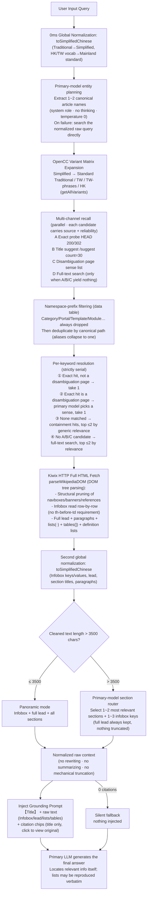

# SimpleUI

<p align="center">
  <a href="README.md">简体中文</a> · <a href="README_EN.md"><b>English</b></a>
</p>

<p align="center">
  <strong>A modern, lightweight AI client deeply customized for <a href="https://github.com/drumih/turbo-fieldfare">TurboFieldfare</a> with broad compatibility for standard inference engines</strong>
</p>

<p align="center">
  React 19 · TypeScript · Vite · Tailwind CSS · KaTeX · Native macOS Dual-Window · Bilingual
</p>

---

## Table of Contents

- [Overview](#overview)
- [System Architecture](#system-architecture)
- [Offline Wiki RAG Pipeline](#offline-wiki-rag-pipeline)
- [Context Window Management](#context-window-management)
- [Inference Engine Compatibility](#inference-engine-compatibility)
- [Quick Start](#quick-start)
- [Project Structure](#project-structure)
- [License](#license)

---

## Overview

SimpleUI is a high-performance, ultra-lightweight frontend client and native macOS desktop application purpose-built for [TurboFieldfare](https://github.com/drumih/turbo-fieldfare) (TTF). Through full OpenAI API compatibility, it also connects seamlessly to **Ollama, vLLM, llama.cpp server, LM Studio**, and other popular local/remote inference engines.

Compared to heavyweight solutions like Open WebUI, SimpleUI eliminates all unnecessary dependencies (no Python virtualenv, FastAPI, SQLite, or vector databases). The frontend bundle is minimal, cold start takes **< 300 ms**, and memory usage is approximately **30 MB**.

The two core technical highlights:

1. **End-to-end Offline Wiki RAG Pipeline**: Zero-truncation, **direct raw-text injection** (article names planned by the primary model; injected body text is never rewritten by any model), with a single model handling all semantic decisions — running entirely on Apple Silicon, no cloud calls.
2. **Two-Phase Dynamic Context Tracking**: Precisely distinguishes peak context usage during generation from clean persistent baseline after completion, reflected in real time on screen.

---

## System Architecture

```
User Input (React Frontend)
     │
     ▼
Node.js Proxy Server (port 31235)
     │
     ├──► Wiki RAG Service (wiki_service.js)
     │         │
     │         ├──► Kiwix Offline Wiki (port 31236 · ZIM file)
     │         └──► Primary Model (port 1235) ← entity planning / long-article section routing
     │
     └──► Primary Inference Model (port 1235 · TTF / Ollama / vLLM etc.) ← final answer generation
```

| Service | Port | Role |
| :--- | :--- | :--- |
| Node.js Proxy (`proxy.js`) | `31235` | SSE passthrough, static hosting, dynamic routing, knowledge-base API |
| Kiwix Offline Encyclopedia | `31236` | ZIM file serving, title suggestions, article HTTP |
| Primary Inference Model | `1235` | Entity planning, long-article section routing, final answer generation |

> Two auxiliary services from the earlier architecture have been removed:
> **LAYA System 1** (port 1236) intent gate — misclassified roughly 1/3 of knowledge questions as chitchat, blocking the entire pipeline;
> **Qwen 3.5 2B** (port 1234) small model — previously handled entity planning, candidate re-ranking, and fact rewriting (MRC),
> now replaced by primary-model planning, a deterministic article-selection rule, and direct raw-text injection.
> The pipeline now depends on only two services: Kiwix and the primary model.

### Cross-Window Synchronization

The Main Window and Spotlight floating panel sync bi-directionally in real time via `BroadcastChannel` (`syncChannel`):

| Message Type | Triggered When | Payload |
| :--- | :--- | :--- |
| `STREAM_TOKEN_PROGRESS` | During streaming (every 20 tokens) | `{ sessionId, liveTokens }` |
| `STREAM_CHUNK` | Every SSE delta | Incremental text |
| `STREAM_DONE` | Generation complete | Final metrics, cleanHistoryTokens |
| `STREAM_ABORT` | User stops generation | sessionId |
| `SESSIONS_CHANGED` | Sessions added/renamed/deleted | - |
| `SETTINGS_CHANGED` | Settings updated | New config |
| `STREAM_QUERY` | Spotlight opens/focuses; main window replays the in-flight stream | Replayed chunks |
| `LOAD_SESSION_IN_SPOTLIGHT` | Main window "shrink to panel" | sessionId |

---

## Offline Wiki RAG Pipeline

SimpleUI builds an **end-to-end, zero-truncation, direct raw-text injection** offline local knowledge retrieval-augmented generation system, running entirely on Apple Silicon — no cloud dependencies.

Core idea: **injected body text is never rewritten by any model**. Article names are planned from the query by the primary model (1~2 canonical names; on planning failure the normalized raw query is searched directly). What gets injected is not a model-written summary but the fetched, normalized raw text — no rewriting, no fabrication.

### Complete Pipeline


```mermaid
flowchart TD
    Q["User Input Query"] --> NORM["0ms Global Normalization: toSimplifiedChinese\n(Traditional→Simplified, HK/TW vocab→Mainland standard)"]
    NORM --> PLAN["Primary-model entity planning\nExtract 1~2 canonical article names\n(system role · no thinking · temperature 0)\nOn failure: search the normalized raw query directly"]

    PLAN --> VARIANTS["OpenCC Variant Matrix Expansion\nSimplified → Standard Traditional / TW / TW-phrases / HK\n(getAllVariants)"]
    VARIANTS --> RECALL["Multi-channel recall (parallel · each candidate carries source + reliability)\nA Exact probe HEAD 200/302\nB Title suggest /suggest count=30\nC Disambiguation page sense list\nD Full-text search (only when A/B/C yield nothing)"]
    RECALL --> FILTER["Namespace-prefix filtering (data table)\nCategory/Portal/Template/Module… always dropped\nThen deduplicate by canonical path (aliases collapse to one)"]
    FILTER --> SELECT["Per-keyword resolution (strictly serial)\n① Exact hit, not a disambiguation page → take 1\n② Exact hit is a disambiguation page → primary model picks a sense, take 1\n③ None matched → containment hits, top ≤2 by generic relevance\n④ No A/B/C candidate → full-text search, top ≤2 by relevance"]
    SELECT --> DOM["Kiwix HTTP Full HTML Fetch\nparseWikipediaDOM (DOM tree parsing):\n  - Structural pruning of navboxes/banners/references\n  - Infobox read row-by-row (no th-before-td requirement)\n  - Full lead + paragraphs + lists(·) + tables(|) + definition lists"]
    DOM --> NORM2["Second global normalization: toSimplifiedChinese\n(Infobox keys/values, lead, section titles, paragraphs)"]
    NORM2 --> BRANCH{"Cleaned text length > 3500 chars?"}
    BRANCH -->|"≤ 3500"| PANO["Panoramic mode\nInfobox + full lead + all sections"]
    BRANCH -->|"> 3500"| ROUTE["Primary-model section router\nSelect 1~2 most relevant sections + 1~3 infobox keys\n(full lead always kept, nothing truncated)"]
    PANO --> CTX["Normalized raw context\n(no rewriting · no summarizing · no mechanical truncation)"]
    ROUTE --> CTX
    CTX --> INJECT["Inject Grounding Prompt\n【Title】 + raw text (Infobox/lead/lists/tables)\n+ citation chips (title only, click to view original)"]
    CTX -->|"0 citations"| SILENT["Silent fallback\nnothing injected"]

    INJECT --> LLM["Primary LLM generates the final answer\nLocates relevant info itself; lists may be reproduced verbatim"]
    SILENT --> LLM
```

### Step-by-Step Technical Notes

#### Step 0: Global Normalization (OpenCC)

`toSimplifiedChinese(text)` uses **opencc-js** in a two-stage cascade:
1. `cn → t`: Aligns Mainland Simplified transcriptions of HK/TW vocabulary (e.g. "记忆体", "软体") into the Traditional dictionary index ("記憶體", "軟體")
2. `twp → cn` + `hk → cn`: Converts regional Traditional forms and idioms back to Mainland Simplified ("内存", "软件")

Applied to the user query, Infobox keys/values, section titles, and body paragraphs for full end-to-end vocabulary alignment. All Chinese script/variant conversion is **handled exclusively by OpenCC** — no hand-written mapping tables.

#### Step 1: Primary-Model Entity Planning

- **Model**: the primary inference model (default Gemma 4 26B-A4B, port 1235)
- **Call convention**: rules in `system`, examples + question in `user` (Gemma 4 natively supports the system role); thinking disabled; `temperature=0` (measured identical quality to the officially recommended 1.0 across 12 fresh questions, but 1.0 causes plan variance)
- **Task**: extract 1~2 canonical encyclopedia entry names from the full natural language query, output pure JSON `{"target_articles": [...]}`
- **Anti-hallucination**: the prompt explicitly requires "default to exactly 1; give 2 only when the question genuinely involves two independent entities; never invent entities"
- **No fallback**: no small-model bailout; on planning failure the normalized raw query is searched directly
- **Performance**: primary-model prefill ≈ 30ms/token, ~9s per planning call; prompt length is the only effective lever (no effective prefix caching)

#### Step 2: OpenCC Variant Matrix Expansion

`getAllVariants(term)` expands each planned entity into all script variants:

| Conversion branch | Example ("鼠标" / mouse) | Example ("激光" / laser) | Example ("周杰伦" / Jay Chou) |
| :--- | :--- | :--- | :--- |
| Mainland Simplified (original) | 鼠标 | 激光 | 周杰伦 |
| Standard Traditional `cn→t` | 鼠標 | 激光 | 周杰倫 |
| Taiwan Traditional `cn→tw` | 鼠標 | 激光 | 周杰倫 |
| Taiwan Traditional + phrases `cn→twp` | 滑鼠 | 雷射 | 周杰倫 |
| Hong Kong Traditional `cn→hk` | 鼠標 | 激光 | 周杰倫 |

**All variants** (including the original term and its normalized form) enter a deduplicated `Set` for subsequent retrieval (the old version only used the first 2~4, causing missed hits), ensuring hits regardless of which script form the ZIM index uses.

> Note the `Set` deduplicates: for most terms `cn→t` / `cn→tw` / `cn→hk` produce the same glyphs (e.g. all three yield "鼠標" for 鼠标),
> so a single keyword usually yields only **2~3 distinct variants** (measured: `鼠标 → [鼠标, 鼠標, 滑鼠]`, `激光 → [激光, 雷射]`).
> The table lists the conversion branches for reference; not every term produces 5 distinct variants.

#### Step 3: Multi-Channel Recall + Namespace Filtering + Normalization

**Multi-channel recall** (executed in parallel; every candidate carries a source tag and a reliability):

| Channel | Endpoint | Purpose | Reliability |
| :--- | :--- | :--- | :--- |
| **A Exact probe** | `HEAD /content/{id}/{variant}` | The keyword *is* the article title (200 exists / 301-302 follows the redirect) | High |
| **B Title suggest** | `/suggest?...&count=30` | Titles that **contain** the keyword | Medium |
| **C Sense catalogue** | The link list of a disambiguation page | Polysemy; also covers candidates whose title lacks the keyword | High |
| **D Full-text search** | `/search?pattern=...` | Articles whose *body* mentions the keyword (aliases, non-standalone topics) | Low |

> Channel D is enabled **only when A/B/C yield no usable candidate**, so noise does not become the norm.

Then three convergence steps:
1. **Namespace filtering**: `Category:`, `Portal:`, `Template:`, `Module:`, `Draft:` and other namespace pages are always dropped (the prefix table is **data**, covering both Chinese and English — not a regex)
2. **Deep redirects**: each candidate gets a `HEAD` (`redirect:manual`) to resolve Kiwix's canonical path — preventing multiple aliases of the same article (e.g. 「康托」→「格奥尔格·康托尔」) from being counted as separate articles
3. **Relevance pre-sort + cap**: candidates are ranked by generic relevance and **only the top 12 are resolved** (no per-candidate HEAD fan-out), then deduplicated by canonical path

#### Step 4: Per-Keyword Resolution (Independent per Keyword, Serial)

Each keyword is resolved **independently**, in this fixed priority:

| Priority | Condition | Behavior |
| :--- | :--- | :--- |
| ① | Exact hit and **not** a disambiguation page | Take that **1** article; keyword done |
| ② | Exact hit **is** a disambiguation page | The **primary model** reads the sense list and picks one; **a pick counts as an exact hit** → take that 1 article; keyword done |
| ③ | Model answers "none matched" | Fall back to titles **containing** the keyword, top **≤2** by generic relevance |
| ④ | No usable A/B/C candidate | Only then enable **full-text search**, top **≤2** by generic relevance |

- **Disambiguation detection** works in three tiers by reliability: ① the page's **own categories** (MediaWiki `wgCategories` metadata) hitting a disambiguation category → treated as a disambiguation page; ② category metadata present but no hit → treated as a normal article, no guessing; ③ only when the metadata is absent does it degrade to structural markers (`#disambigbox`, or `disambig` / `mw-disambig` classes on **non-`<a>` elements** — `<a class="mw-disambig">` merely *links to* a disambiguation page) and structural traits (no Infobox + no `<h2>` + very little prose + many link list items). Measured: the category rule gives 0 false positives across 35 normal articles and 100% recall on real disambiguation pages
- **Sense selection is fully delegated to the primary model** (the prompt requires "the name must match the candidate list verbatim; output `null` if none is relevant") — the old hardcoded entity-type scoring has been deleted
- **Generic relevance** (pure arithmetic, zero word lists): `coverage (longest matching variant ÷ title length) + prefix-match bonus + channel-reliability bonus − over-long-title penalty`
- The two keywords are independent and yield at most 2 articles each; all processed **strictly serially** (the primary model does not support concurrency)

#### Step 5: Full HTML Fetch & DOM Parsing

`parseWikipediaDOM(html)` builds a **DOM tree** (via `node-html-parser`) and extracts by **node type** — it no longer "coaxes" HTML with regexes:

1. **Structural pruning**: whole subtrees are removed by tag (`script` / `style` / `link` …), by MediaWiki standard classes (`navbox` / `ambox` / `reflist` / `mw-editsection` / `sortkey` / `magnify` / `mw-hidden-catlinks` …) and by **inline `display:none`** (`figure` / `thumb` / `gallery` are *not* dropped — they carry captions, see item 5). The inline-style rule matters: MathML accessibility copies of formulas and hidden categories live there. **Formulas themselves are kept verbatim**: in an offline wiki a formula exists only as "image + LaTeX source" (`img.alt` / `math.alttext` / `<annotation>` are the same text; `img.title` is empty), so its LaTeX is injected (`\pi`, `{1 \over 2}R`, `f:[0,1]\rightarrow \mathbb {C}` — directly readable by an LLM), with only MathJax's `\displaystyle` / `\textstyle` style commands removed and **the braces kept** (dropping the braces too turns `{1 \over 2}R` into the ambiguous `1 \over 2R`)
2. **Tail cutoff**: at the first "boilerplate" section heading (Notes / References / External links / See also…, a multilingual data table) everything onward is dropped
3. **Infobox extracted as a whole**: iterates `<tr>`, **does not require** `<th>` before `<td>`, and handles nested sub-tables; multiple values in a row are joined with `|`, and value-only continuation rows attach to the most recent key
4. **Structure split**: every `<h2>` in document order starts a new section; `<h3>` / `<h4>` content belongs to its enclosing section
5. **In-order content block extraction**: `<p>` paragraphs, `<ul>/<ol>` lists (`·` lines), `<table>` tables (`| cell | cell |` pipe tables), `<dl>` definition lists (`key: value`), `<blockquote>` / `<pre>` quotes. **No length filtering**. Two extra fidelity rules: ① **superscripts / subscripts** are marked with `^` / `_` so exponents and indices survive (otherwise `3.00×10⁸` flattens to `3.00×108`, which reads like one hundred and eight, and `H₂O` to `H2O`); ② the extraction embeds **structured markers** (next section) so the panel can render rich text.

#### Step 5.1: Structured markers and panel rendering

The side panel must be *readable*, while what reaches the model must stay **plain text** — one extraction feeds both, split by markers:

| Marker | Payload | Injection side | Panel side |
| :--- | :--- | :--- | :--- |
| `tex` | LaTeX | the LaTeX itself (unchanged) | **KaTeX formula** (inline, including inside table cells) |
| `tbl` | JSON (header row count + cells, with `colspan`/`rowspan`) | pipe-table text (unchanged) | a **real `<table>`**: `<th>` header, merged cells, horizontal scroll |
| `img` | src + caption | `[图略] caption` | the **real image + caption** (src resolved same-origin) |
| `sh` | level + title | empty string (the old code also omitted subheading text) | a **subheading** (h3/h4, previously lost entirely) |

Design notes:

- Markers are wrapped in **Unicode private-use characters** (U+E000 start / U+E001 end), which never occur in wiki text, so they cannot collide with the content.
- **Nested escaping**: an inner marker's terminator is escaped to U+E002 before being embedded in an outer payload, and restored on parse. Without this, "a formula inside a table cell" or "a formula inside a subheading" (e.g. 《圆周率》's "计算 π 的意义") truncates the outer marker.
- **Zero change on the injection side**: markers are resolved *before* the character count, so the 3500-char branch, the pipe-table format, the `[图略]` wording and the omitted subheading text stay **byte-identical to before** (guarded by a baseline regression).
- Disambiguation sense descriptions are also resolved first, so markers never leak into the prompt.
- Formulas render with `katex` (already a dependency, styles imported globally); macros KaTeX does not support fall back to showing the LaTeX instead of an error.

> **Zero-truncation principle**: Content is never character-truncated. Cleaning only targets "elements browsers don't render" and "non-article pages"; article text is always kept.

#### Step 6: Second Global Normalization

All Infobox keys, values, section titles, lead paragraphs, and body paragraphs are passed through `toSimplifiedChinese` again, eliminating script and vocabulary bias from ZIM files stored in Traditional Chinese. Measured: the Traditional article 《周杰倫》 produces zero Traditional-script residue.

#### Step 7: Long-Article Routing

- **Standard articles (≤ 3500 chars, ~75%)**: `panoramic` mode — full Infobox + full lead + all sections
- **Extra-long articles (> 3500 chars)**: `routed` mode — the **primary model** selects 1~2 most relevant sections and 1~3 infobox keys from the heading outline; the **complete paragraphs** of those sections are included in full, and the **full lead is always kept** — nothing truncated
- **Fallbacks**: if the model selects no section → the first 2 sections; if it selects no key → the first 8 infobox keys
- **Threshold scope**: the 3500-char count is over the normalized "lead + all sections" text, **excluding the Infobox**

#### Step 8: Direct Raw-Text Injection (No MRC)

The earlier architecture had a "Machine Reading Comprehension" step here: a small model read the article and compressed it into one factual sentence. In practice it **fabricated** (producing "Goldbach's conjecture was proposed by Georg Cantor" from the Cantor-set article). That step has been removed entirely.

Now the normalized raw text produced by `assembleArticleContext` is **injected directly** into the primary model, which locates the relevant information itself and combines it with its own knowledge:
- No rewriting means no fabrication
- Enumeration questions ("list all works") can reproduce the original lists verbatim
- Clicking a citation chip shows this exact injected plain text **above the full article text** in the knowledge panel — **verifiable** (the panel renders the extracted text natively; the original wiki page is reachable via the panel's "Open in browser" button)

#### On Context Capacity (the former "context-budget loading" has been removed)

An earlier version guarded injection with a "context budget": the frontend estimated `budgetChars` as `maxContext - maxTokens` and passed it to the backend, which dropped whole articles over budget and returned `contextOverflow` when none fit. In practice that budget was derived purely from settings and **never looked at how much the conversation had already consumed**, so it was a constant that effectively never triggered — a false safeguard.

It has now been **removed end-to-end** (both `budgetChars` / `usableTokens` and `contextOverflow` are gone). Whatever is retrieved is injected in full, with no truncation or selection step before injection; size your context window accordingly.

#### Injection Prompt

```
[Encyclopedia Context]
Below are one or more encyclopedia articles (Infobox, lead section and relevant
body sections) retrieved from an offline knowledge base for the user's question.

【Article Title】
<raw text>

[How to answer]
1. [Relevance filtering]: The context may contain material that is not related to
   the question (e.g. infobox fields, section headings, list entries). Locate the
   parts that actually answer the question and ignore the rest.
2. [Fact grounding]: Treat the facts, dates, people and numbers found there as
   your factual anchor. Combine them with your own knowledge when they are partial.
3. [Reproduce when asked]: If the user asks you to enumerate or list something
   (e.g. all works, all awards), reproduce the corresponding list from the context
   faithfully — do not shorten or omit items.
4. [Cite]: Mention which encyclopedia article(s) you used.

[User Question]
<original question>
```

The Grounding Prompt is an ephemeral wrapper, **never written to persistent conversation history**.

> Note: this Grounding Prompt is provided by a single shared module, `src/services/chatTurn.ts` — the **main window and the Spotlight panel use the same implementation, verbatim**. Retrieval gating, wire-message construction and session-scoped parameter assembly (thinking / knowledge-base toggles) are all consolidated there, so neither window keeps its own copy.

### Core Design Principles

1. **No-rewrite injection**: Injected content comes entirely from the fetched, normalized raw text and is never summarized or rewritten by a model; article names are planned by the primary model (no full-text search; the raw query is the fallback), replacing the old small-model MRC step. No rewriting means no fabrication.
2. **Zero-truncation**: Article text is passed intact — no character truncation, and no "drop it whole" budget trade-off either: whatever is retrieved is injected in full.
3. **Zero-contamination**: The Grounding Prompt is ephemeral — never written to persistent conversation history.
4. **Zero mechanical rules**: No keyword regex stripping, no hardcoded greeting bypass, no regex-based fact-relevance filtering; Chinese script conversion is delegated to OpenCC and disambiguation sense selection is delegated to the primary model — the old hardcoded entity-type scoring has been deleted.
5. **Abstention first**: Any step that yields nothing silently exits; the primary LLM falls back to general knowledge without noise injection. A missed citation costs far less than a wrong one.
6. **DOM tree parsing**: HTML is always parsed into a tree and extracted/pruned by **node type**, never coaxed with regexes; structural decisions rely on HTML tags and MediaWiki standard class names, which are language-independent.
7. **Single model, strictly serial**: Only the primary model makes semantic decisions (planning / sense selection / section routing / generation), and it is called strictly serially — it does not support concurrent requests; there is no in-memory result cache.

### Knowledge Base Service Switch

The "Enable knowledge base service" option in Settings is a **service-level master switch** (persisted in `wiki_config.json`):

| Master switch | ZIM ready | Chat 📚 button | Sidebar service row |
| :--- | :--- | :--- | :--- |
| Off | any | not rendered | row disappears (service process killed) |
| On | yes | shown · clickable | ready (with article count) |
| On | no | shown · disabled | offline |

The session-level 📚 toggle defaults to OFF (knowledge-base retrieval is still early-stage experimentation) and must be enabled manually. Both the session-level 🧠 thinking toggle and the 📚 knowledge-base toggle are saved per session and synced bidirectionally in real time between the main window and the Spotlight panel via `BroadcastChannel` — the two windows always share the same Q&A parameters.

### Turn Stage Indicator & Abort

With the session-level 📚 enabled, a turn passes through several stages before the first answer token arrives. The UI shows **at most one stage indicator at any moment** (same style as the thinking accordion; the main window and the Spotlight panel share the single `TurnStageIndicator` component), driven by real server-side instrumentation (`GET /api/wiki/rag-stage`):

| UI label | Pipeline step | When | Typical time |
| :--- | :--- | :--- | :--- |
| 🌀 Planning search terms | Primary-model entity planning (model call ①) | every turn | 8–11s |
| 🌀 Locating articles · i/N · entity | Variant expansion + kiwix multi-channel recall + candidate scoring | once per keyword | 1–5s |
| 🌀 Picking sense · entity | Primary-model sense selection (model call ②) | only when a disambiguation page is hit | 8–10s |
| 🌀 Fetching article · title | kiwix full-HTML fetch + DOM parsing + normalization | once per selected article | 0.5–2s |
| 🌀 Planning sections | Primary-model section routing (model call ③) | only when the cleaned article exceeds 3500 chars | 8–10s |
| ◍ Loading context x% | TTF prefill (ring gauge) | every turn | scales with injection size |

Notes:

- "Assembling context" is millisecond-scale string concatenation — not instrumented, not shown.
- Planning / sense / routing are **primary-model calls** (strictly serial, unpredictable duration) — spinner only, no percentage; the prefill percentage is estimated as `elapsed × recent measured rate ÷ real prompt tokens` (ring gauge, capped at 99%).
- The retrieval phase is **excluded** from the prefill estimate's clock (`prefillStartedAt` is stamped separately when RAG completes).
- The whole pipeline contains **exactly these 3 primary-model calls** — there are no hidden ones.

**Abort**: pressing "Stop" at any stage immediately removes this turn's placeholder message and propagates an `AbortSignal` down
`rag-context → getRagContext → planQuery / pickSenseWithMainModel / assembleArticleContext(routing…)`
— an in-flight primary-model call is genuinely cancelled by TTF (`cancelled by client`), the serial model is released right away, and no process or memory is left behind. The same applies to aborts during prefill / thinking / generation; once a turn ends (including interrupted ones), the action buttons and the timing metrics row are shown as usual.

**Key parameters (verified line-by-line against `server/wiki_service.js`)**:

| Parameter | Actual value | Function |
| :--- | :--- | :--- |
| Target articles | ≤ 2 (falls back to the normalized raw question) | `getRagContext` |
| Variant matrix | ≤ 6 glyph forms: original / simplified / cn→t / tw / twp / hk | `getAllVariants` |
| Channel A exact probe | kiwix `/content` **HEAD** following 301/302, timeout 1.2s, reliability 0.95 | `_probeExact` |
| Channel B title suggest | `/suggest count=30`, timeout 1.5s, reliability 0.6 | `_suggestTitles` |
| Channel D full-text | `/search pageLength=8`, timeout 2.5s, reliability 0.35 (last resort) | `_fullTextSearch` |
| Candidate convergence | relevance-ranked, only the top **12** get a canonical HEAD (2s each), deduped by canonical path | `_resolveCandidates` |
| Article fetch | GET timeout 2.5s | `_getPage` |
| 3500 branch | counted over **lead + section paragraphs (Infobox excluded)** | `assembleArticleContext` |
| Routing fallbacks | no matched sections → first 2 sections; no matched keys → first 8 Infobox keys; the lead is always kept in full | `assembleArticleContext` |
| Containment / full-text hits | ≤ 2 articles each (`rejectStrongDisambig=true`, strong disambiguation pages skipped) | `_resolveForKeyword` |
| Model call params | temperature 0 · top_p 0.95 · top_k 64 · max_tokens 64/80 · thinking off · SSE streaming · 30s per-call timeout | `callMainModel` |

---

## Context Window Management

### Two-Phase Dynamic Tracking (Surge / Recede)

```
During generation (Phase 1 — Surge):
  liveStreamingTokens = initialPromptTokens + generated tokens so far
  ← Refreshed every 20 tokens, synchronized across both windows via BroadcastChannel

After generation (Phase 2 — Recede):
  liveStreamingTokens = null
  displayTokens = persistentHistoryTokens (computed via useMemo)
  ← Only counts durable history (user messages + final assistant answers), naturally lower
```

**Why two phases are necessary:**

During generation, context includes: persistent history + RAG Grounding Prompt (size depends on the retrieved articles; there is no budget cap any more) + reasoning model `reasoningContent`. After generation, the next turn's `wireMessages` only sends `msg.content` — no `reasoningContent`, no RAG prompt. The actual token count drops significantly.

**During generation, the number is a real measurement wherever possible (TTF-only enhancement):**

| Source | Provides | Available |
| :--- | :--- | :--- |
| Server log `prepared prompt=N` | the **real prompt token count** | **before generation starts** (measured: ~180 ms after the request is sent) |
| SSE event count | the in-flight increment | per token (measured on TTF: events ÷ tokens = 1.00 / 0.99) |
| `usage` (final chunk) | prompt / completion / `cached_tokens` / `reasoning_tokens` | at completion |

Mechanism: the Node proxy exposes a read-only endpoint `GET /api/ttf/request?id=<chatcmpl-…>` that parses the TTF log by request id (default `~/Library/Logs/turbo-fieldfare.log`, overridable via `TTF_LOG_FILE`). The frontend queries it as soon as the first SSE chunk reveals the id, and **replaces the ring's estimated baseline with the real value**.

> Fallback: when the log is unavailable (non-TTF engines such as Ollama / vLLM / llama.cpp, or a cleared log) it silently reverts to the estimator — it never errors.

The old approach stored `metrics.totalTokens` (~5,000) into `session.contextUsed`, leaving the ring stuck at peak even when the next turn would only use ~300 tokens. The fix: `onDone` calls `estimateHistoryTokens` to compute clean persistent history tokens and stores that as `contextUsed`. The ring naturally recedes after each generation.

### Token Estimator (`src/utils/token.ts`)

The estimator is a **heuristic**; benchmarked against the real tokenizer, its error varies widely with content type:

| Content | real ÷ estimate |
| :--- | :--- |
| Pure Chinese | 1.27 (under-estimates 27%) |
| Traditional Chinese | 1.35 (under-estimates 35%) |
| Digit-heavy | 2.65 (under-estimates 165%) |
| Pure English | 0.76 (over-estimates 32%) |
| Long English words | 0.39 (over-estimates 156%) |

It therefore now serves **only as the fallback when no real value is available** (non-TTF engines, or the log is not yet readable).

**Session-level calibration**: after every turn, the ratio of the *real* `usage.prompt_tokens` to the *raw* estimate for the very same messages is stored and applied **at the display layer only** (`applyTokenCalibration`), so it adapts automatically to any tokenizer or model. Measured across the four toggle combinations (thinking × knowledge base), the post-generation display error versus the next turn's real prompt improves from the raw −17% ~ −25% to **within ±15%**.

```typescript
// CJK characters: ~0.75 tokens/char; non-CJK: ~1 token / 3.8 chars
// Per-message chat template overhead: +4 tokens; image: +576 tokens/image
estimateTextTokens(text: string): number
estimateHistoryTokens(messages: Array<Partial<ChatMessage>>, systemPrompt?: string): number
setTokenCalibration(realTokens, rawEstimatedTokens): void  // called per turn from api.ts
applyTokenCalibration(tokens: number): number              // used by the display layer
```

`estimateHistoryTokens` **only counts**: user `content`, assistant `content` (final answer), image attachments.  
**Explicitly excludes**: `reasoningContent` (chain-of-thought), ephemeral RAG Grounding Prompt.

### Context Ring Display Rules

| Window | During Generation | After Generation |
|---|---|---|
| **Main Window (large)** | `liveStreamingTokens` drives ring + remaining % text shown to the right | `persistentHistoryTokens` drives ring + remaining % |
| **Spotlight (small)** | `liveStreamingTokens` drives ring — circle only | `persistentHistoryTokens` drives ring — circle only |

Remaining percentage format: `≥ 99.95%` displays as `100%`, otherwise `X.X%` (e.g. `98.6%`).

---

## Inference Engine Compatibility

SimpleUI is most deeply optimized for TurboFieldfare (TTF) while fully supporting the standard OpenAI API:

| Service | Port | Deep Thinking | Vision |
| :--- | :--- | :--- | :--- |
| **TurboFieldfare (TTF)** | `1235` | ✅ Native (`chat_template_kwargs` + `reasoning_effort`) | ✅ Auto-detected |
| **Ollama** | `11434` | Depends on model template | Depends on model |
| **vLLM** | `8000` | Depends on model template | Depends on model |
| **llama.cpp server** | `8080` | Depends on model template | Depends on model |
| **LM Studio** | `1234` | Depends on model template | Depends on model |

> **Routing mechanism**: The `x-target-port` request header tells the Node.js proxy which port to forward to. Switching inference engines requires no proxy restart.

---

## Quick Start

### Prerequisites
- Node.js ≥ 18
- A running local or LAN inference service (recommended: [TurboFieldfare](https://github.com/drumih/turbo-fieldfare) on default port `1235`)

### Option 1: One-Command Start (Recommended)
```bash
./start.sh
```
Auto-detects inference service, installs dependencies (first run), builds, starts proxy, and opens `http://127.0.0.1:31235`.

### Option 2: Dev Mode with Hot Reload
```bash
./start.sh dev
# or
npm run dev
```

### Option 3: Build macOS Desktop App
```bash
./build_mac_app.sh install
```
Compiles and installs to `/Applications/SimpleUI.app`. Supports global hotkey `⌥ Option + Space` to summon the Spotlight floating panel.

---

## Project Structure

```
SimpleUI/
├── server/
│   ├── proxy.js              # Node.js proxy server (port 31235)
│   │                         #   SSE passthrough, static hosting, dynamic port routing
│   ├── ttf_log.js            # Read-only TTF log probe (real prompt tokens before generation)
│   ├── wiki_service.js       # Offline RAG pipeline core
│   │                         #   Primary-model planning / sense selection / section routing
│   │                         #   Multi-channel recall (exact probe · suggest · senses · full-text)
│   │                         #   + namespace filtering + redirect deduplication
│   │                         #   parseWikipediaDOM (DOM tree: structural pruning + paragraphs/
│   │                         #   lists/tables/definition lists), assembleArticleContext
│   │                         #   toSimplifiedChinese, getAllVariants (OpenCC)
│   └── laya_mlx_server.py    # LAYA System 1 service (removed from the pipeline, file kept for reference)
│
├── mac_app/                  # macOS native dual-window wrapper (Swift + WebKit)
│   ├── src/                  # AppDelegate, HotKey, WindowControllers
│   └── Resources/            # Info.plist, AppIcon.icns
│
└── src/
    ├── App.tsx               # Top-level state machine, session management, liveStreamingTokens
    ├── services/
    │   ├── api.ts            # Inference engine communication, SSE parsing, onTokenProgress
    │   ├── chatTurn.ts       # Single implementation of one chat turn (grounding prompt / gating / messages)
    │   └── storage.ts        # localStorage persistence, BroadcastChannel
    ├── utils/
    │   └── token.ts          # Offline token estimator (CJK + non-CJK + images)
    └── components/
        ├── ContextRing.tsx   # SVG dynamic context ring (showRemainingPercent option)
        ├── ChatInput.tsx     # Composite input (thinking toggle, images, send/stop)
        ├── SpotlightView.tsx # Spotlight panel complete state machine
        ├── ChatView.tsx      # Main conversation view
        ├── MessageItem.tsx   # Single message (thinking accordion, Markdown, KaTeX)
        ├── WikiPanel.tsx     # The single knowledge-panel implementation: injected text + rich full
        │                     #   article (formulas/tables/images/subheadings) + search.
        │                     #   WikiSidebar (main window, docked) and WikiDrawer (Spotlight, overlay)
        │                     #   are thin shells over it, so both windows render byte-identically
        └── SettingsModal.tsx # Parameter config, inference port, language settings
```

---

## License

SimpleUI is released under the [Apache License 2.0](LICENSE).
